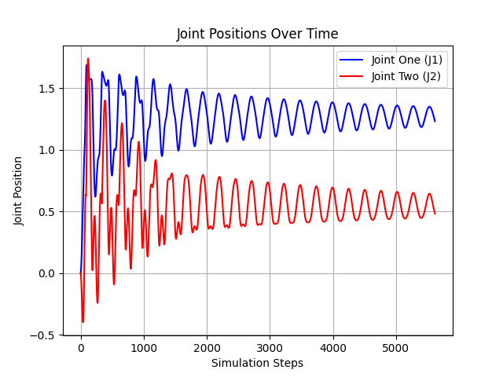

# Lab 2 — Passive RR Mechanism Simulation with Elastic Tendons in MuJoCo


> **Course:** Simulation of Robotic Systems — Faculty of Control Systems and Robotics, ITMO University <br>
> **Author:** Umer Ahmed Baig Mughal — MSc Robotics and Artificial Intelligence <br>
> **Topic:** RR Mechanism Modelling · MuJoCo XML · Spatial Tendons · Pulley Routing · Passive Joint Dynamics · Generalized Coordinate Tracking

---

## Table of Contents

1. [Objective](#objective)
2. [Theoretical Background](#theoretical-background)
   - [Physical System Description](#physical-system-description)
   - [RR Mechanism Kinematics](#rr-mechanism-kinematics)
   - [Tendon-Driven Elastic Dynamics](#tendon-driven-elastic-dynamics)
   - [System Properties](#system-properties)
3. [MuJoCo Model Architecture](#mujoco-model-architecture)
   - [RR Mechanism Without Tendons](#rr-mechanism-without-tendons)
   - [Integrating Spatial Tendons](#integrating-spatial-tendons)
   - [XML Key Commands Reference](#xml-key-commands-reference)
4. [System Parameters](#system-parameters)
5. [Implementation](#implementation)
   - [File Structure](#file-structure)
   - [Function Reference](#function-reference)
   - [Algorithm Walkthrough](#algorithm-walkthrough)
6. [How to Run](#how-to-run)
7. [Results](#results)
8. [Simulation Analysis](#simulation-analysis)
9. [Dependencies](#dependencies)
10. [Notes and Limitations](#notes-and-limitations)
11. [Author](#author)
12. [License](#license)

---

## Objective

This lab performs **physics-based simulation modelling** of a passive RR (Revolute-Revolute) mechanism of open kinematics with two elastic cables routed over pulleys — implemented in the MuJoCo physics engine using its XML model description format. The system is simulated in real-time using a passive viewer, and the generalized joint coordinates are tracked, recorded, and visualized over time.

The key learning outcomes are:

- Studying MuJoCo XML examples of cable and tendon usage to understand spatial tendon routing conventions.
- Constructing a **hierarchical body tree** in MuJoCo XML representing the RR mechanism with correct link dimensions, joint axes, and physical density assignments.
- Placing **named sites** at precise geometric locations on the links and walls to serve as tendon anchor and routing points.
- Modelling cylindrical **pulleys** at joint locations using MuJoCo's `<geom type="cylinder">` element and understanding their role in guiding tendon paths.
- Adding **two spatial elastic tendons** routed over both pulleys using the `<tendon><spatial>` element, with configurable stiffness to generate restoring forces on the passive joints.
- Writing a Python script using the `mujoco` and `mujoco.viewer` APIs to load the XML model, step the simulation forward in real-time, collect generalized position data (`qpos`) from both joints at every timestep, and generate multiple plots comparing joint behaviour.
- Analysing the **damped oscillatory response** of both joints under the influence of elastic tendon forces and joint spring-damper parameters, and interpreting convergence to equilibrium.

The lab is implemented in a single Python script operating on one MuJoCo XML model file, together producing three output plots for both 5-second and 15-second simulation runs.

---

## Theoretical Background

### Physical System Description

The system under study is a **passive RR mechanism of open kinematics** — a two-link serial chain with two revolute joints, where no actuators or external torques are applied. The mechanism is mounted horizontally at a fixed wall, and both joints rotate freely about the $y$-axis. Motion is driven entirely by gravity acting on the link masses and the restoring forces from two elastic cables (tendons) routed over cylindrical pulleys attached at each joint.

The two tendons cross between the two pulleys in opposing directions, producing a pair of elastic restoring forces that resist joint displacement and generate oscillatory behaviour when the system is released from a non-equilibrium initial configuration. The joint spring-damper parameters defined in the MuJoCo defaults further introduce viscous damping that dissipates energy over time.

The configuration of the system at any instant is fully described by the **generalized coordinates** $q_1$ (joint `one`) and $q_2$ (joint `two`), representing the angular positions of the first and second revolute joints respectively.

### RR Mechanism Kinematics

The mechanism consists of three rigid links connected in a serial chain:

```
Fixed wall → Link 0 (length a) → Joint one → Link 1 (length b) → Joint two → Link 2 (length c) → Fixed wall
```

The kinematic parameters define the distances between the joints and boundary attachment points:

```
a = 0.045 m    Distance from fixed left wall to Joint one (first revolute joint)
b = 0.039 m    Length of intermediate link between Joint one and Joint two
c = 0.055 m    Length of distal link from Joint two to the right wall attachment
```

Both joints rotate about the $y$-axis (out of plane), with motion constrained to $[-90°, +90°]$ by hard joint limits. In MuJoCo's body hierarchy, each child body is positioned relative to its parent:

- The first body (`body pos="0 0 .3"`) anchors the mechanism at height $z = 0.3$ m above the floor.
- The first revolute joint (`joint name="one"`) is placed at the end of link 0 (offset `pos=".045 0 0"` from parent).
- The second revolute joint (`joint name="two"`) is placed at the end of link 1 (offset `pos=".039 0 0"` from the first joint body).
- Link 2 extends from Joint two over length $c = 0.055$ m to the right wall anchor.

### Tendon-Driven Elastic Dynamics

The elastic tendons are modelled as **spatial tendons** in MuJoCo, which define a piecewise-linear cable that connects a sequence of anchor sites, wrapping around cylindrical pulleys at specified side-sites. Each tendon contributes a **restoring force** proportional to its elongation, governed by its stiffness coefficient.

The two tendons are routed in opposing directions to create a crossed-cable configuration:

```
Tendon 1 (red):   s1  →  Pulley1 [side: s3]  →  c1  →  Pulley2 [side: s5]  →  s8
Tendon 2 (green): s2  →  Pulley1 [side: s4]  →  c1  →  Pulley2 [side: s6]  →  s7
```

This crossing configuration ensures that when one joint rotates in one direction, at least one tendon is placed under tension and produces a restoring torque that opposes the motion. The elastic force in each tendon is:

```
F_tendon = k_tendon × ΔL
```

where $k_{\text{tendon}} = 10$ N/m is the spatial stiffness and $\Delta L$ is the elongation of the tendon beyond its rest length. The interaction of both tendons with the two pulleys and the joint spring-damper (`springdamper="1 100"`) results in the coupled oscillatory dynamics observed in the simulation.

The generalized equations of motion for the passive system can be expressed as:

```
M(q)·q̈ + C(q, q̇)·q̇ + K_d·q̇ + K_s·q + F_tendon(q) = 0
```

where $M(q)$ is the mass matrix, $C(q,\dot{q})$ contains Coriolis and centrifugal terms, $K_d$ is the joint damping matrix (from `springdamper` damping coefficient), $K_s$ is the joint spring stiffness matrix, and $F_{\text{tendon}}(q)$ is the generalized force from the two spatial tendons. MuJoCo solves these equations numerically at each timestep using its built-in constrained dynamics solver.

### System Properties

For the given parameters (joints: springdamper=`1 100`, tendons: stiffness=`10`, link densities=`5000 kg/m³`):

| Property | Value | Notes |
|----------|-------|-------|
| Number of revolute joints | 2 | Joint `one` and joint `two` |
| Joint rotation axis | $y$-axis (`0 1 0`) | Both joints, out-of-plane rotation |
| Joint angular range | $[-90°,\; +90°]$ | Hard limits on both joints |
| Joint spring stiffness | 1 N·m/rad | From `springdamper="1 100"` |
| Joint damping coefficient | 100 N·m·s/rad | From `springdamper="1 100"` |
| Tendon stiffness (each) | 10 N/m | `<spatial stiffness="10">` |
| Number of tendons | 2 | Red (s1→s8) and Green (s2→s7) |
| Pulley radius | R1 = R2 = 0.01 m | Cylindrical geoms at both joints |
| Link material density | 5000 kg/m³ | Capsule geoms for all links |
| Simulation timestep | 0.002 s (MuJoCo default) | `m.opt.timestep` |
| Simulation duration | 5 s / 15 s | Two run configurations in the script |
| System type | Underdamped with elastic restoration | Oscillatory, decaying to equilibrium |

The large joint damping value (100 N·m·s/rad) relative to spring stiffness (1 N·m/rad) means the joint spring-damper contributes predominantly **dissipative** behaviour, while the tendons at stiffness 10 N/m provide the primary restoring force. The system is underdamped overall — oscillations are sustained for multiple cycles before settling — with damping becoming increasingly effective as the amplitude decreases.

---

## MuJoCo Model Architecture

### RR Mechanism Without Tendons

The first stage of the model development establishes the geometric and kinematic skeleton of the RR mechanism without any tendons. This baseline captures the link geometry, joint placement, pulley geometry, and site layout that will later serve as tendon anchors.

**Body hierarchy:**

```
<worldbody>
 └── body (pos="0 0 .3")               ← mechanism base, height z=0.3m
      ├── left_wall (box geom)          ← fixed left boundary wall
      ├── geom (capsule, a=0.045m)      ← Link 0: base to Joint one
      ├── sites s1, s2                  ← left-wall tendon anchors (±z offset)
      └── body (pos=".045 0 0")         ← Joint one body
           ├── joint "one" (y-axis)     ← first revolute joint
           ├── geom (capsule, b=0.039m) ← Link 1: Joint one to Joint two
           ├── Pulley1 (cylinder)       ← pulley at Joint one, R1=0.01m
           ├── sites s3, s4             ← pulley side-sites (±z offset)
           ├── site c1                  ← midpoint inter-pulley anchor
           └── body (pos=".039 0 0")    ← Joint two body
                ├── joint "two" (y-axis)← second revolute joint
                ├── geom (capsule,c=0.055m) ← Link 2: Joint two to right wall
                ├── Pulley2 (cylinder)  ← pulley at Joint two, R2=0.01m
                ├── sites s5, s6        ← pulley side-sites (±z offset)
                ├── sites s7, s8        ← right-wall tendon anchors (±z offset)
                └── body                ← right wall body
                     └── right_wall (box geom) ← fixed right boundary wall
```

**Site layout — 9 named sites across the mechanism:**

| Site | Parent Body | Position (local) | Purpose |
|------|------------|-----------------|---------|
| `s1` | Base body | `(0, 0, +0.015)` | Left wall upper tendon anchor |
| `s2` | Base body | `(0, 0, −0.015)` | Left wall lower tendon anchor |
| `s3` | Joint one body | `(0, 0, +0.012)` | Pulley1 upper side-site |
| `s4` | Joint one body | `(0, 0, −0.012)` | Pulley1 lower side-site |
| `c1` | Joint one body | `(+0.02, 0, 0)` | Mid-link inter-pulley waypoint |
| `s5` | Joint two body | `(0, 0, −0.012)` | Pulley2 lower side-site |
| `s6` | Joint two body | `(0, 0, +0.012)` | Pulley2 upper side-site |
| `s7` | Joint two body | `(+0.055, 0, +0.015)` | Right wall upper tendon anchor |
| `s8` | Joint two body | `(+0.055, 0, −0.015)` | Right wall lower tendon anchor |

The site z-offsets (`±0.015` at walls, `±0.012` at pulleys) are calibrated to the pulley radius ($R = 0.01$ m) plus clearance, so that the tendon path is geometrically consistent with wrapping around the pulley cylinder.

### Integrating Spatial Tendons

After the baseline model is established with all sites in place, the `<tendon>` block is appended to the XML. Two `<spatial>` tendons are defined, each routing through both pulleys in opposing directions to create the crossed-cable configuration shown in Figure 1 of the task description.

**Tendon 1 — Red cable (s1 → s8):**

```xml
<spatial stiffness="10" rgba="1 0 0 1">
    <site site="s1" />
    <geom geom="Pulley1" sidesite="s3" />
    <site site="c1" />
    <geom geom="Pulley2" sidesite="s5" />
    <site site="s8" />
</spatial>
```

**Tendon 2 — Green cable (s2 → s7):**

```xml
<spatial stiffness="10" rgba="0 1 0 1">
    <site site="s2" />
    <geom geom="Pulley1" sidesite="s4" />
    <site site="c1" />
    <geom geom="Pulley2" sidesite="s6" />
    <site site="s7" />
</spatial>
```

Both tendons share the intermediate waypoint `c1` and use opposite side-sites on each pulley (`s3`/`s4` on Pulley1, `s5`/`s6` on Pulley2), creating the crossing geometry. The `rgba` attributes assign distinct colours (red and green) for visual distinction in the viewer.

### XML Key Commands Reference

| XML Element / Attribute | Purpose |
|------------------------|---------|
| `<joint springdamper="1 100">` | Sets joint spring stiffness (1 N·m/rad) and damping (100 N·m·s/rad) as defaults for all joints |
| `<joint limited="true" range="-90 90">` | Enforces ±90° hard angular limits on both revolute joints |
| `<geom type="capsule" size=".005">` | Default capsule cross-section radius for all link geometries |
| `<geom type="cylinder" fromto="..." size=".01">` | Defines a cylindrical pulley of radius 0.01 m spanning ±0.01 m in the y-direction |
| `<site name="..." pos="...">` | Places a named anchor point at a specific local position; used as tendon attachment or routing waypoints |
| `<spatial stiffness="10">` | Defines a spatial tendon (cable) with elastic stiffness of 10 N/m |
| `<geom geom="Pulley1" sidesite="s3">` | Routes the tendon around the named cylindrical geom, approaching from the side specified by `sidesite` |
| `<statistic center="..." extent="...">` | Sets the viewer camera centre and scene extent for default framing |
| `contype="0" conaffinity="0"` | Disables collision detection for the base link geometry (cosmetic only) |
| `density="5000"` | Assigns physical density (kg/m³) to link capsule geoms for realistic mass distribution |

---

## System Parameters

### Geometric Parameters (Given Task Values)

| Parameter | Symbol | Value | Unit | Description |
|-----------|--------|-------|------|-------------|
| Base link length | $a$ | 0.045 | m | Distance from left wall to Joint one |
| Intermediate link length | $b$ | 0.039 | m | Length from Joint one to Joint two |
| Distal link length | $c$ | 0.055 | m | Length from Joint two to right wall |
| Pulley 1 radius | $R_1$ | 0.01 | m | Cylinder radius at Joint one |
| Pulley 2 radius | $R_2$ | 0.01 | m | Cylinder radius at Joint two |

### Dynamic Parameters (MuJoCo Model Defaults)

| Parameter | Value | Unit | Source |
|-----------|-------|------|--------|
| Joint spring stiffness | 1 | N·m/rad | `springdamper="1 100"` |
| Joint damping coefficient | 100 | N·m·s/rad | `springdamper="1 100"` |
| Tendon stiffness (both) | 10 | N/m | `<spatial stiffness="10">` |
| Link density | 5000 | kg/m³ | `density="5000"` on capsule geoms |
| Capsule cross-section radius | 0.005 | m | `<geom size=".005">` default |
| Pulley half-thickness | 0.01 | m | `fromto="0 .01 0 0 -.01 0"` |

### Simulation Parameters (Python Script)

| Parameter | Value | Unit | Description |
|-----------|-------|------|-------------|
| Short simulation duration | 5 | s | First run configuration |
| Extended simulation duration | 15 | s | Second run configuration (script default) |
| MuJoCo timestep | 0.002 | s | `m.opt.timestep` (model default) |
| Contact point toggle period | 2 | s | `mjVIS_CONTACTPOINT` toggled every 2 s |
| Joint one name | `'one'` | — | Queried via `mj_name2id` |
| Joint two name | `'two'` | — | Queried via `mj_name2id` |

---

## Implementation

### File Structure

```
Lab_2/
├── README.md
├── src/                              # Python simulation script
│   └── Passive_RR_Mechanism.py                       # Simulation runner, data collection, plotting
├── model/                            # MuJoCo XML model
│   └── MuJoCo_Model_Lab2.xml                         # Full RR mechanism model with tendons
├── results/                          # Generated plots / outputs
│   ├── J1_Position_5s.png                # Joint one position over 5-second run
│   ├── J2_Position_5s.png                # Joint two position over 5-second run
│   ├── J1_Position_15s.png               # Joint one position over 15-second run
│   ├── J2_Position_15s.png               # Joint two position over 15-second run
│   ├── Combined_5s.png                   # J1 and J2 overlaid — 5-second run
│   └── Combined_15s.png                  # J1 and J2 overlaid — 15-second run
└── report/                           # Lab documentation
    └── Lab2_Report.pdf
```

**Script and model grouping by purpose:**

| File | Type | Purpose |
|------|------|---------|
| `MuJoCo_Model_Lab2.xml` | MuJoCo XML | Full model definition: body hierarchy, joints, pulleys, sites, tendons, visual settings |
| `Passive_RR_Mechanism.py` | Python | Loads XML model, runs passive viewer, collects `qpos`, generates 3 plots |

### Function Reference

#### Model Loading — `Passive_RR_Mechanism.py`

Loads the MuJoCo model from the XML file and initialises simulation state.

```python
m = mujoco.MjModel.from_xml_path('MuJoCo_Model_Lab2.xml')
d = mujoco.MjData(m)
```

| Object | Type | Description |
|--------|------|-------------|
| `m` | `MjModel` | Static model data: geometry, joints, tendons, defaults, assets |
| `d` | `MjData` | Dynamic simulation state: `qpos`, `qvel`, forces, contact data |

---

#### Joint Position Query — inside simulation loop

Retrieves the current generalized position of a named joint at each simulation step using `mj_name2id` to resolve the joint name to its internal index.

```python
d.qpos[m.jnt_qposadr[mujoco.mj_name2id(m, mujoco.mjtObj.mjOBJ_JOINT, 'one')]]
d.qpos[m.jnt_qposadr[mujoco.mj_name2id(m, mujoco.mjtObj.mjOBJ_JOINT, 'two')]]
```

| API Call | Purpose |
|----------|---------|
| `mj_name2id(m, mjOBJ_JOINT, name)` | Resolves joint name string to integer joint ID |
| `m.jnt_qposadr[id]` | Maps joint ID to its starting address in the `qpos` array |
| `d.qpos[addr]` | Returns the scalar generalized position (radians) of the joint |

**Returns:** `float` — angular position of the queried joint in radians at the current simulation time.

---

#### Simulation Step — `mujoco.mj_step(m, d)`

Advances the MuJoCo simulation by one timestep (`m.opt.timestep`). Internally computes:

- Forward kinematics and dynamics
- Tendon length and force computation
- Joint spring-damper forces
- Constraint solver (contact resolution)
- State integration (position and velocity update)

---

#### Viewer Contact Toggle — inside `viewer.lock()` block

Dynamically toggles the contact point visualisation flag every 2 simulated seconds, providing a visual indicator of constraint activity during the passive simulation.

```python
viewer.opt.flags[mujoco.mjtVisFlag.mjVIS_CONTACTPOINT] = int(d.time % 2)
```

| Parameter | Description |
|-----------|-------------|
| `mjVIS_CONTACTPOINT` | MuJoCo visualization flag index for contact point rendering |
| `int(d.time % 2)` | Evaluates to `0` or `1` alternating every 2 seconds of simulation time |

---

#### Timing Control — sleep loop

Ensures the simulation runs at real-time speed by sleeping for the remainder of each timestep after `mj_step` completes.

```python
time_until_next_step = m.opt.timestep - (time.time() - step_start)
if time_until_next_step > 0:
    time.sleep(time_until_next_step)
```

---

#### Plot Generation — `matplotlib.pyplot`

After the simulation loop exits, three separate figures are generated:

| Plot | Data | Label | Colour |
|------|------|-------|--------|
| Plot 1 — J1 alone | `y_values` (joint `one` qpos) | `"J1"` | Matplotlib default blue |
| Plot 2 — J2 alone | `x_values` (joint `two` qpos) | `"J2"` | Matplotlib default blue |
| Plot 3 — J1 + J2 overlaid | both lists | `"Joint One (J1)"`, `"Joint Two (J2)"` | Blue / Red |

All three plots include axis labels, titles, grid lines, and legends.

---

### Algorithm Walkthrough

**Simulation and data collection loop (`Passive_RR_Mechanism.py`):**

```
1. Load XML model:
       m = MjModel.from_xml_path('MuJoCo_Model_Lab2.xml')
       d = MjData(m)

2. Initialise data collectors:
       y_values = []       ← stores qpos of joint 'one' (J1) at each step
       x_values = []       ← stores qpos of joint 'two' (J2) at each step

3. Launch passive viewer:
       with mujoco.viewer.launch_passive(m, d) as viewer:

4. Simulation loop (runs while viewer is open AND elapsed time < 15 s):

       a. Record current joint positions:
              y_values.append( qpos of joint 'one' )
              x_values.append( qpos of joint 'two' )

       b. Step simulation forward:
              mujoco.mj_step(m, d)

       c. Toggle contact point visibility every 2 seconds:
              viewer.opt.flags[mjVIS_CONTACTPOINT] = int(d.time % 2)

       d. Sync viewer to reflect updated state

       e. Sleep for remaining timestep duration (real-time pacing)

5. After loop exits, generate plots:

       Plot 1: y_values vs step index  →  "Joint One Position Over Time"
       Plot 2: x_values vs step index  →  "Joint Two Position Over Time"
       Plot 3: both overlaid           →  "Joint Positions Over Time"

6. plt.show() — display all three figures
```

### Joint Positions




---

## How to Run

### Clone the Repository

```bash
git clone https://github.com/umerahmedbaig7/Simulation-of-Robotic-Systems.git
cd Simulation-of-Robotic-Systems/Lab_2
```

### Prerequisites

```bash
pip install mujoco matplotlib
```

> MuJoCo 2.3+ with the Python bindings (`mujoco` package) is required. The viewer requires a display environment (not headless).

### Update the XML Path

Open `src/Passive_RR_Mechanism.py` and update the model path to point to your local copy of `MuJoCo_Model_Lab2.xml`:

```python
m = mujoco.MjModel.from_xml_path('path/to/MuJoCo_Model_Lab2.xml')
```

### Running the Simulation

```bash
python src/Passive_RR_Mechanism.py
```

This will:

1. Open the MuJoCo passive viewer window showing the RR mechanism with red and green tendons.
2. Run the simulation for **15 seconds** in real-time.
3. After the viewer closes, generate and display **3 Matplotlib plots** sequentially.

### Changing Simulation Duration

Open `Passive_RR_Mechanism.py` and modify the time limit in the `while` condition:

```python
while viewer.is_running() and time.time() - start < 15:   # change 15 to desired seconds
```

To replicate the 5-second run (Figures 7–8 and 11 in the report):

```python
while viewer.is_running() and time.time() - start < 5:
```

### Modifying Tendon or Joint Parameters

To change tendon stiffness, edit the `<spatial>` elements in `MuJoCo_Model_Lab2.xml`:

```xml
<spatial stiffness="10" rgba="1 0 0 1">    <!-- change stiffness value here -->
```

To change joint spring-damper settings, edit the `<default>` block:

```xml
<joint springdamper="1 100" ... />         <!-- spring stiffness | damping coefficient -->
```

---

## Results

### Joint Position Plots — $t_f = 5$ s

| Plot | Joint | Approximate Amplitude Range | Initial Amplitude (rad) |
|------|-------|----------------------------|------------------------|
| Figure 7 (J1 alone) | Joint `one` | 0.00 – 1.75 rad | ~0.0 (rises rapidly) |
| Figure 8 (J2 alone) | Joint `two` | −0.50 – 1.75 rad | ~0.0 (drops then rises) |
| Figure 11 (J1 + J2) | Both overlaid | −0.50 – 1.75 rad | Blue (J1) / Red (J2) |

### Joint Position Plots — $t_f = 15$ s

| Plot | Joint | Converged Amplitude Range (rad) | Behaviour |
|------|-------|--------------------------------|-----------|
| Figure 9 (J1 alone) | Joint `one` | ~1.10 – 1.40 rad | Decaying oscillation → steady periodic |
| Figure 10 (J2 alone) | Joint `two` | ~0.40 – 0.60 rad | Decaying oscillation → steady periodic |
| Figure 12 (J1 + J2) | Both overlaid | J1: 1.10–1.40, J2: 0.40–0.60 | J1 higher amplitude than J2 |

### Qualitative Observations

**At $t_f = 5$ s:**
- Both joints start at rest ($q_1 = q_2 = 0$) and immediately undergo large-amplitude transient oscillations driven by the initial non-equilibrium loading of the tendons under gravity.
- J2 drops briefly to negative values (~−0.5 rad) before the tendons arrest the motion and pull it back — reflecting the crossed-cable geometry where both tendons act asymmetrically on the second joint.
- The oscillations are irregular early on due to the coupled nonlinear dynamics of the two-joint system.

**At $t_f = 15$ s:**
- The transient behaviour from the first ~3 seconds gives way to a more regular, lower-amplitude oscillation.
- Both joints converge toward a steady oscillatory regime with significantly reduced amplitude compared to the initial transient — the damping and tendon restoring forces progressively remove energy from the system.
- J1 stabilises at a higher mean angle (~1.25 rad) than J2 (~0.50 rad), reflecting the asymmetric loading from gravity and the different lever arms of the tendons at each joint.

---

## Simulation Analysis

### Oscillatory Behaviour and Damping

Both joint positions exhibit **damped oscillatory motion** throughout the simulation. The large amplitude transients at the start are characteristic of a lightly damped system responding to an initial impulse — in this case, the release from zero displacement into a configuration where gravity and tendon pre-tension create significant restoring forces.

The joint damping coefficient of 100 N·m·s/rad is the primary dissipative mechanism. Over the 15-second simulation, the amplitude of each oscillation decreases progressively, consistent with a system whose energy is being continuously drained by viscous damping at both joints.

### Tendon Stiffness and Restoring Forces

The elastic tendons (stiffness $k = 10$ N/m each) act as the primary **restoring mechanism**. Without them, the passive joints would simply fall under gravity with only the joint spring (stiffness 1 N·m/rad) resisting displacement. The tendons provide a cross-coupled restoring force that links the motion of both joints, which is why J1 and J2 oscillate with related but distinct frequencies and amplitudes.

| Effect | Source | Observation |
|--------|--------|-------------|
| Oscillatory motion | Tendon restoring forces + joint spring | Both J1 and J2 oscillate continuously |
| Amplitude decay | Joint damping (coefficient = 100) | Oscillations shrink progressively over 15 s |
| J2 smaller amplitude than J1 | Tendon geometry — shorter moment arm at J2 | J2 converges faster than J1 |
| Negative J2 values early | Cross-tendon coupling — initial J2 overshoot | J2 dips to ~−0.5 rad in first cycle |
| Steady-state oscillation | Balance of tendon stiffness and damping | Both joints reach periodic regime by ~5–7 s |

### Effect of Simulation Duration

Extending the simulation from 5 s to 15 s reveals behaviour that is not visible in the short run:

- The **irregular multi-frequency transient** of the first 3 seconds resolves into a more regular single-frequency oscillation — the dominant mode of the coupled system.
- The **amplitude envelope** clearly shows monotonic decay, confirming the system is asymptotically stable.
- The **mean equilibrium angle** of each joint becomes apparent: J1 settles around ~1.25 rad, J2 around ~0.50 rad — determined by the balance of gravitational torque and tendon restoring force at the equilibrium configuration.

---

## Dependencies

| Package | Version | Purpose |
|---------|---------|---------|
| `Python` | ≥ 3.8 | Runtime environment |
| `mujoco` | ≥ 2.3 | Physics simulation engine, XML model loading, passive viewer, `mj_step`, `qpos` access |
| `mujoco.viewer` | (bundled with `mujoco`) | Real-time passive viewer for simulation visualization |
| `Matplotlib` | ≥ 3.4 | Joint position time-series plots, combined comparison figures |

Install all dependencies via pip:

```bash
pip install mujoco matplotlib
```

> A working display (X server on Linux, or native on Windows/macOS) is required for the MuJoCo passive viewer. For headless environments, use `mujoco.viewer` in offscreen mode or replace with `mujoco.Renderer`.

---

## Notes and Limitations

- **XML file path is hardcoded:** The script uses an absolute path (`D:\ITMO University\...`) to load the XML model. Before running, update `from_xml_path(...)` in `Passive_RR_Mechanism.py` to match your local file location, or place `MuJoCo_Model_Lab2.xml` in the working directory and use a relative path.
- **Units:** All lengths are in **metres**; all angular values (joint positions in `qpos`) are in **radians**; time is in **seconds**.
- **`y_values` stores J1, `x_values` stores J2:** Despite their naming suggesting Cartesian coordinates, `y_values` holds the generalized position of joint `one` and `x_values` holds joint `two`. This is a naming convention in the script unrelated to spatial coordinates.
- **Contact detection is partially disabled:** The base link (`Link 0`) has `contype="0" conaffinity="0"`, meaning it does not participate in collision detection. This is intentional — the base link is a static structural element and does not need contact response.
- **The simulation plots step index, not time:** The x-axis of all three plots is the sample index (loop iteration count), not simulation time in seconds. At MuJoCo's default timestep of 0.002 s, approximately 500 steps correspond to 1 second of simulation time (e.g., ~2000 steps for 5 s, ~6000 steps for 15 s). Modify the plot `x`-axis to `np.arange(len(y_values)) * m.opt.timestep` for a time-labelled axis.
- **No actuators or external forces:** The simulation is fully **passive** — joints are driven only by gravity, tendon restoring forces, and joint spring-damper effects. Adding `<actuator>` elements would allow active control of joint torques.
- **Tendon rest length is computed automatically:** MuJoCo computes the rest length of each spatial tendon from the initial configuration at simulation start ($q = 0$). Any elongation beyond this rest length generates the elastic restoring force. This means the equilibrium position depends on the initial geometry.
- **Fixed-point tendon routing via `c1`:** Both tendons pass through the shared intermediate site `c1` at position `(0.02, 0, 0)` on the Joint one body. This ensures the tendons maintain a geometrically consistent path across both pulleys but means the two tendons share a common waypoint and their paths are coupled.
- **Viewer must remain open:** The simulation loop runs only while `viewer.is_running()` is `True`. Closing the viewer window before the time limit will stop data collection and produce truncated plots with fewer samples.
- **Real-time pacing may drift on slow hardware:** The `time.sleep()` timing control is best-effort. On machines where `mj_step` computation exceeds `m.opt.timestep`, the simulation will run slower than real-time and the wall-clock duration will exceed the specified simulation seconds.

---

## Author

**Umer Ahmed Baig Mughal** <br>
Master's in Robotics and Artificial Intelligence <br>
*Specialization: Machine Learning · Computer Vision · Human-Robot Interaction · Autonomous Systems · Robotic Motion Control*

---

## License

This project is intended for **academic and research use**. It was developed as part of the *Simulation of Robotic Systems* course within the MSc Robotics and Artificial Intelligence program at ITMO University. Redistribution, modification, and use in derivative academic work are permitted with appropriate attribution to the original author.

---

*Lab 2 — Simulation of Robotic Systems | MSc Robotics and Artificial Intelligence | ITMO University*

