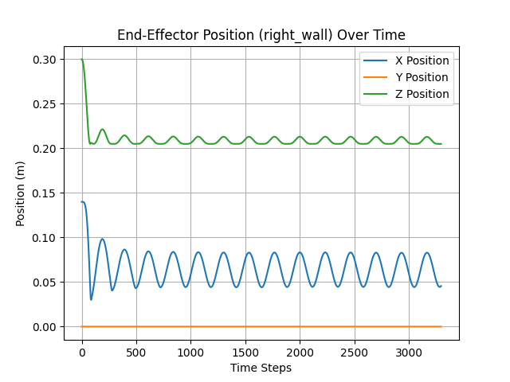

# Lab 3 — Actuated RR Mechanism with PD Motor Control in MuJoCo


> **Course:** Simulation of Robotic Systems — Faculty of Control Systems and Robotics, ITMO University <br>
> **Author:** Umer Ahmed Baig Mughal — MSc Robotics and Artificial Intelligence <br>
> **Topic:** Motor Actuation · Position Actuator · PD Controller · Sinusoidal Trajectory Tracking · End-Effector Kinematics · Euler Angle Extraction

---

## Table of Contents

1. [Objective](#objective)
2. [Theoretical Background](#theoretical-background)
   - [Physical System Description](#physical-system-description)
   - [From Passive to Actuated — Key Changes](#from-passive-to-actuated--key-changes)
   - [Sinusoidal Target Trajectory](#sinusoidal-target-trajectory)
   - [PD Controller Formulation](#pd-controller-formulation)
   - [End-Effector Kinematics and Orientation](#end-effector-kinematics-and-orientation)
   - [System Properties](#system-properties)
3. [MuJoCo Model Architecture](#mujoco-model-architecture)
   - [Actuation Methods in MuJoCo XML](#actuation-methods-in-mujoco-xml)
   - [Adding the Position Actuator](#adding-the-position-actuator)
   - [XML Key Commands Reference](#xml-key-commands-reference)
4. [System Parameters](#system-parameters)
5. [Implementation](#implementation)
   - [File Structure](#file-structure)
   - [Function Reference](#function-reference)
   - [Algorithm Walkthrough](#algorithm-walkthrough)
6. [How to Run](#how-to-run)
7. [Results](#results)
8. [Simulation Analysis](#simulation-analysis)
9. [Dependencies](#dependencies)
10. [Notes and Limitations](#notes-and-limitations)
11. [Author](#author)
12. [License](#license)

---

## Objective

This lab extends the passive RR mechanism from Lab 2 by **adding a motor actuator to joint B** and implementing a **PD (Proportional-Derivative) controller** to drive it along a sinusoidal target trajectory. The end-effector position and orientation are tracked throughout the simulation and visualized as time-series plots, providing a complete analysis of the actuated system's kinematic and dynamic behaviour.

The key learning outcomes are:

- Exploring the three main actuation methods available in MuJoCo XML — torque-based actuation, velocity control, and tendon-linked motors — and understanding when each is appropriate.
- Modifying the Lab 2 XML model to add a `<position>` actuator at joint B, configuring its `ctrllimited`, `ctrlrange`, and `gear` attributes for safe and precise position control.
- Implementing a **PD controller** in Python that computes a control signal at each simulation step based on the position error and joint velocity, and writes it to the actuator's control input `data.ctrl`.
- Generating a **sinusoidal reference trajectory** for joint B using the given amplitude and constant angle, and tracking how closely the controlled joint follows it.
- Extracting the **end-effector position** (x, y, z) from `data.geom_xpos` and computing its **pitch orientation** by reshaping the `geom_xmat` rotation matrix and converting it to Euler angles using `scipy.spatial.transform.Rotation`.
- Generating and interpreting **four output plots**: joint positions, joint velocities, end-effector 3D position, and end-effector pitch orientation over the 10-second simulation.

The lab is implemented in a single Python script operating on one MuJoCo XML model file (extended from Lab 2), producing four output plots that characterize both the joint-level and task-space behaviour of the actuated system.

---

## Theoretical Background

### Physical System Description

The system is the same RR mechanism from Lab 2 — a two-link serial chain with two revolute joints (now named **A** and **B**) mounted horizontally between two fixed walls, with two elastic spatial tendons routed over cylindrical pulleys — with one critical modification: **joint B is now motorized** via a position actuator. Joint A remains passive, driven only by the tendon restoring forces and gravity.

The `right_wall` box geometry, rigidly attached to the distal end of link 2 (beyond joint B), serves as the **end-effector** whose position and pitch orientation are monitored throughout the simulation. This represents the tool or attachment point at the tip of the kinematic chain.

The control objective is to drive joint B to track a **sinusoidal reference trajectory** of the form:

```
q_B_target(t) = A · sin(ω · t)
```

where $A = 1.073$ rad is the amplitude and $\omega = 1.564$ rad/s is the angular frequency (referred to as `constant_angle` in the script). The PD controller computes the actuator command at each timestep to minimize the tracking error.

### From Passive to Actuated — Key Changes

Compared to the Lab 2 model, three targeted changes are made:

| Aspect | Lab 2 (Passive) | Lab 3 (Actuated) |
|--------|----------------|-----------------|
| Joint names | `one`, `two` | `A`, `B` |
| Joint spring-damper | `springdamper="1 100"` in defaults | **Removed** — no default spring-damper |
| Actuator | None | `<position name="Motor B" joint="B" ...>` |
| Control | No control signal | PD controller writes to `data.ctrl` |
| Tendons | Unchanged (stiffness=10) | Unchanged (stiffness=10) |
| End-effector tracking | Not tracked | Position (x,y,z) + pitch recorded |

Removing the joint spring-damper from the defaults means joint A is now purely passive under gravity and tendon forces, while joint B is exclusively controlled by the motor actuator commanded by the PD controller.

### Sinusoidal Target Trajectory

The reference trajectory for joint B is a sinusoid with zero phase shift and zero DC offset:

```
q_B_target(t) = amplitude × sin(constant_angle × t)
             = 1.073 × sin(1.564 × t)    [radians]
```

| Parameter | Variable | Value | Unit | Role in trajectory |
|-----------|----------|-------|------|-------------------|
| Amplitude | `amplitude` | 1.073 | rad | Peak angular displacement of joint B |
| Frequency | `frequency` | 3.2 | Hz | Defined but **not used** in the formula — see Notes |
| Constant angle | `constant_angle` | 1.564 | rad/s | Angular frequency $\omega$ in the sine argument |
| Phase shift | — | 0 | rad | Zero — trajectory starts at $q = 0$ |
| DC offset | — | 0 | rad | Zero — trajectory oscillates symmetrically about $q = 0$ |

The `constant_angle` value of 1.564 rad/s corresponds to approximately 0.249 Hz oscillation frequency ($f = \omega / 2\pi \approx 0.249$ Hz), meaning joint B completes roughly one full oscillation every 4 seconds over the 10-second simulation.

### PD Controller Formulation

The PD controller is a feedback control law that computes a control signal at each timestep based on two terms:

```
control_signal = KP × position_error  −  KD × current_velocity

where:
    position_error   = q_B_target(t)  −  q_B_current
    current_velocity = q̇_B_current    (from data.qvel)
    KP = 0.005    (Proportional gain)
    KD = 0.005    (Derivative gain)
```

**Proportional term** (`KP × position_error`): Drives the joint toward the target position. A larger error produces a larger corrective force. The gain KP = 0.005 is intentionally small to avoid over-actuation given the `ctrlrange="-1 1"` clamp on the actuator.

**Derivative term** (`−KD × current_velocity`): Dampens oscillations by penalizing rapid joint motion. This prevents overshoot and ensures the joint approaches the target smoothly. KD = 0.005 matches the proportional gain, providing balanced proportional-derivative response.

The computed control signal is written directly to `data.ctrl[actuator_id]`, which is then applied by the MuJoCo `<position>` actuator at joint B during the next `mj_step`.

**Control signal clamp:** The actuator has `ctrllimited="true"` and `ctrlrange="-1 1"`, so the MuJoCo engine automatically clamps the control signal to `[−1, 1]` before applying it to the joint, preventing unsafe over-actuation regardless of the PD output magnitude.

### End-Effector Kinematics and Orientation

The end-effector is the `right_wall` box geometry at the tip of the kinematic chain. Its state is tracked in two ways at every simulation step:

**Position** — extracted directly from `data.geom_xpos`:

```python
site_id = mujoco.mj_name2id(m, mujoco.mjtObj.mjOBJ_GEOM, 'right_wall')
end_effector_pos = d.geom_xpos[site_id]   # returns [x, y, z] in world frame
```

**Orientation (pitch)** — extracted from `data.geom_xmat`, which stores the $3 \times 3$ rotation matrix of each geometry in row-major flattened form:

```
1. wall_orientation = data.geom_xmat[geom_id]    → flat 9-element array
2. rotation_mat     = np.reshape(wall_orientation, (3, 3))
3. rotation         = R.from_matrix(rotation_mat)  (scipy Rotation object)
4. euler_angles     = rotation.as_euler('xyz', degrees=True)
5. pitch            = euler_angles[1]              → rotation about y-axis (degrees)
```

The pitch angle (rotation about the $y$-axis) is the physically meaningful orientation for this mechanism, since both joints rotate about the $y$-axis and the end-effector's tilt in the $x$–$z$ plane directly reflects the cumulative joint rotation $q_A + q_B$.

### System Properties

| Property | Value | Notes |
|----------|-------|-------|
| Number of revolute joints | 2 | Joint `A` (passive) and joint `B` (actuated) |
| Joint rotation axis | $y$-axis (`0 1 0`) | Both joints |
| Joint angular range | $[-90°,\; +90°]$ | Hard limits, both joints |
| Joint spring-damper | None | Removed from defaults (cf. Lab 2) |
| Tendon stiffness (each) | 10 N/m | Unchanged from Lab 2 |
| Actuated joint | `B` only | Joint `A` remains passive |
| Actuator type | `<position>` | Drives joint B to target position |
| Actuator control range | $[-1,\; 1]$ | `ctrllimited="true"`, `ctrlrange="-1 1"` |
| Actuator gear ratio | 1 | `gear="1"` — no torque scaling |
| PD gains | KP = KD = 0.005 | Small gains matched to ctrlrange |
| Target trajectory | $1.073 \sin(1.564\, t)$ | Sinusoidal, zero phase, zero offset |
| End-effector reference | `right_wall` geom | Box geometry at tip of link 2 |
| Simulation duration | 10 s | Fixed wall-clock loop condition |
| Simulation timestep | 0.002 s | Set explicitly in script (`m.opt.timestep`) |
| Output plots | 4 | Positions, velocities, EE position, EE pitch |

---

## MuJoCo Model Architecture

### Actuation Methods in MuJoCo XML

Before adding the actuator to the model, three standard actuation approaches available in MuJoCo XML are examined:

**1. Torque-Based Actuation**
Motors operate in torque mode, directly applying a torque to the specified joint. Suitable for force-controlled systems such as robotic arms or compliant mechanisms.

```xml
<actuator>
    <motor name="torque_motor" joint="joint_1" gear="1" />
</actuator>
```

**2. Velocity Control**
Motors are configured to drive a joint at a desired velocity. Commonly used for conveyor belts, rotational systems, or any application requiring constant speed.

```xml
<actuator>
    <velocity name="velocity_motor" joint="joint_2" ctrllimited="true" ctrlrange="-5 5" />
</actuator>
```

**3. Tendons with Motors**
Motors are linked to tendons rather than joints directly, enabling distributed or cable-driven actuation. Useful for pulley-based or underactuated systems.

```xml
<actuator>
    <motor name="tendon_motor" tendon="tendon_1" />
</actuator>
```

For this lab, the **position actuator** (`<position>`) is used — it drives joint B toward a target position value written to `data.ctrl`, making it the natural choice for trajectory tracking with a PD controller.

### Adding the Position Actuator

The XML model from Lab 2 is extended by appending an `<actuator>` block after the `<tendon>` section. The only structural changes to the XML relative to Lab 2 are: joint names changed from `one`/`two` to `A`/`B`, the `springdamper` attribute removed from the joint defaults, and the following actuator block added:

```xml
<actuator>
    <position name="Motor B" joint="B" ctrllimited="true" ctrlrange="-1 1" gear="1" />
</actuator>
```

**Full updated body hierarchy (changes highlighted):**

```
<worldbody>
 └── body (pos="0 0 .3")
      ├── left_wall (box geom)
      ├── geom (capsule, a=0.045m)
      ├── sites s1, s2
      └── body (pos=".045 0 0")
           ├── joint "A" (y-axis)          ← renamed from "one", no springdamper
           ├── geom (capsule, b=0.039m)
           ├── Pulley1 (cylinder, R1=0.01m)
           ├── sites s3, s4, c1
           └── body (pos=".039 0 0")
                ├── joint "B" (y-axis)     ← renamed from "two", no springdamper
                ├── geom (capsule, c=0.055m)
                ├── Pulley2 (cylinder, R2=0.01m)
                ├── sites s5, s6, s7, s8
                └── body
                     └── right_wall (box geom)  ← end-effector

<tendon>  (unchanged from Lab 2)
    Tendon 1 (red):   s1 → Pulley1[s3] → c1 → Pulley2[s5] → s8
    Tendon 2 (green): s2 → Pulley1[s4] → c1 → Pulley2[s6] → s7

<actuator>  (NEW in Lab 3)
    Motor B: position actuator on joint "B"
```

### Actuated MuJoCo Model


### XML Key Commands Reference

| XML Element / Attribute | Purpose |
|------------------------|---------|
| `<joint axis="0 1 0" limited="true" range="-90 90">` | Default joint: y-axis rotation, ±90° hard limits — **no springdamper** (removed vs Lab 2) |
| `<position name="Motor B" joint="B">` | Declares a position actuator named "Motor B" targeting joint B |
| `ctrllimited="true"` | Enables clamping of the control signal to the specified `ctrlrange` |
| `ctrlrange="-1 1"` | Restricts the control signal to the interval $[-1, 1]$, preventing over-actuation |
| `gear="1"` | Sets the transmission ratio — gear=1 means the control signal maps 1:1 to joint torque/force |
| `data.ctrl[actuator_id]` | Python API: sets the control input for the actuator at each simulation step |
| `mj_name2id(m, mjOBJ_ACTUATOR, name)` | Resolves actuator name string to its integer ID for indexing `data.ctrl` |

---

## System Parameters

### Geometric Parameters (Inherited from Lab 2)

| Parameter | Symbol | Value | Unit | Description |
|-----------|--------|-------|------|-------------|
| Base link length | $a$ | 0.045 | m | Distance from left wall to Joint A |
| Intermediate link length | $b$ | 0.039 | m | Length from Joint A to Joint B |
| Distal link length | $c$ | 0.055 | m | Length from Joint B to right wall (end-effector) |
| Pulley 1 radius | $R_1$ | 0.01 | m | Cylinder radius at Joint A |
| Pulley 2 radius | $R_2$ | 0.01 | m | Cylinder radius at Joint B |

### Controller and Trajectory Parameters (Given Task Values)

| Parameter | Variable | Value | Unit | Description |
|-----------|----------|-------|------|-------------|
| Target motor | — | B | — | Only joint B is actuated |
| Trajectory amplitude | `amplitude` | 1.073 | rad | Peak angle of sinusoidal reference for joint B |
| Trajectory frequency | `frequency` | 3.2 | Hz | Defined in script — not used in formula (see Notes) |
| Angular frequency | `constant_angle` | 1.564 | rad/s | Used as $\omega$ in `sin(constant_angle × t)` |
| Proportional gain | `KP` | 0.005 | — | PD controller proportional term |
| Derivative gain | `KD` | 0.005 | — | PD controller derivative term |

### Actuator Parameters (MuJoCo XML)

| Parameter | Value | Source |
|-----------|-------|--------|
| Actuator type | `<position>` | `<position name="Motor B" ...>` |
| Actuator name | `"Motor B"` | Used to look up `actuator_id` via `mj_name2id` |
| Linked joint | `"B"` | `joint="B"` |
| Control limited | `true` | `ctrllimited="true"` |
| Control range | $[-1,\; 1]$ | `ctrlrange="-1 1"` |
| Gear ratio | 1 | `gear="1"` |

### Simulation Parameters

| Parameter | Value | Unit | Description |
|-----------|-------|------|-------------|
| Simulation duration | 10 | s | Wall-clock loop limit |
| Timestep | 0.002 | s | Set explicitly: `m.opt.timestep = 0.002` |
| Effective sampling rate | 500 | steps/s | $1 / 0.002$ |
| Total data points | ~5000 | steps | At 500 steps/s over 10 s |
| End-effector reference | `right_wall` | — | `mjOBJ_GEOM` queried by name |

---

## Implementation

### File Structure

```
Lab_3/
├── README.md
├── src/                                  # Python simulation script
│   └── Actuated_RR_Mechanism.py              # PD controller, data collection, 4 plots
├── model/                                # MuJoCo XML model
│   └── MuJoCo_Model_with_Actuators.xml       # RR mechanism + tendons + Motor B actuator
├── results/                              # Generated plots / outputs
│   ├── Joint_Positions_AB.png                # Joint A & B positions over 10 s
│   ├── Joint_Velocities_AB.png               # Joint A & B velocities over 10 s
│   ├── End_Effector_Position.png             # End-effector x, y, z position over 10 s
│   └── End_Effector_Pitch.png                # End-effector pitch orientation over 10 s
└── report/                               # Lab documentation
    └── Lab3_Report.pdf
```

**Script and model grouping by purpose:**

| File | Type | Purpose |
|------|------|---------|
| `MuJoCo_Model_with_Actuators.xml` | MuJoCo XML | Extended Lab 2 model with `<position>` actuator at joint B |
| `Actuated_RR_Mechanism.py` | Python | PD controller, sinusoidal trajectory, 4-plot data visualization |

### Function Reference

#### Model Loading — `Actuated_RR_Mechanism.py`

Loads the MuJoCo model and initialises simulation state objects.

```python
m = mujoco.MjModel.from_xml_path('MuJoCo_Model_with_Actuators.xml')
d = mujoco.MjData(m)
```

| Object | Type | Description |
|--------|------|-------------|
| `m` | `MjModel` | Static model: geometry, joints, tendons, actuator definitions |
| `d` | `MjData` | Dynamic state: `qpos`, `qvel`, `ctrl`, `geom_xpos`, `geom_xmat` |

---

#### `get_rotation(model, data, site_name)` — orientation extraction

Extracts the $3 \times 3$ rotation matrix of the `right_wall` geometry from `data.geom_xmat`, converts it to a `scipy` `Rotation` object, and returns the Euler angles in degrees using the `'xyz'` convention.

```python
def get_rotation(model, data, site_name):
    wall_orientation = data.geom_xmat[mujoco.mj_name2id(model, mujoco.mjtObj.mjOBJ_GEOM, 'right_wall')]
    rotation_mat = np.reshape(wall_orientation, (3, 3))
    rotation = R.from_matrix(rotation_mat)
    euler_angles = rotation.as_euler('xyz', degrees=True)
    return euler_angles
```

| Argument | Type | Description |
|----------|------|-------------|
| `model` | `MjModel` | MuJoCo model object |
| `data` | `MjData` | Current simulation state |
| `site_name` | `str` | Name of the geometry (`'right_wall'`) — used for context; geom ID is hardcoded |

**Returns:** `np.ndarray([roll, pitch, yaw])` — Euler angles in degrees (`'xyz'` convention). Only `euler_angles[1]` (pitch) is used in the simulation loop.

---

#### `controller(model, data, joint_name, target_position)` — PD control

Implements the PD control law for a named joint and writes the computed control signal to the corresponding actuator in `data.ctrl`.

```python
def controller(model, data, joint_name, target_position):
    KP = 0.005
    KD = 0.005
    joint_id       = mujoco.mj_name2id(model, mujoco.mjtObj.mjOBJ_JOINT, joint_name)
    current_position = data.qpos[model.jnt_qposadr[joint_id]]
    current_velocity = data.qvel[model.jnt_dofadr[joint_id]]
    position_error   = target_position - current_position
    control_signal   = KP * position_error - KD * current_velocity
    actuator_id      = mujoco.mj_name2id(model, mujoco.mjtObj.mjOBJ_ACTUATOR, joint_name)
    data.ctrl[actuator_id] = control_signal
```

| Argument | Type | Description |
|----------|------|-------------|
| `model` | `MjModel` | MuJoCo model object |
| `data` | `MjData` | Current simulation state |
| `joint_name` | `str` | Name of the joint to control (`"B"`) |
| `target_position` | `float` | Desired joint angle in radians at current timestep |

**Control law:** `control_signal = KP × (target − current_position) − KD × current_velocity`

**Note:** The actuator name `"B"` is resolved via `mj_name2id` with `mjOBJ_ACTUATOR`. This works because the actuator in the XML is named `"Motor B"` — however, the script queries by joint name `"B"`, not the actuator name `"Motor B"`. This relies on MuJoCo resolving the lookup correctly via the joint association. In practice, the actuator index is found via `mj_name2id(..., mjOBJ_ACTUATOR, "B")`.

---

#### `get_end_effector_data()` — position and orientation recording

Records the current position (x, y, z) and pitch orientation of the `right_wall` end-effector into the respective data lists.

```python
def get_end_effector_data():
    site_id = mujoco.mj_name2id(m, mujoco.mjtObj.mjOBJ_GEOM, 'right_wall')
    end_effector_pos = d.geom_xpos[site_id]
    end_effector_positions["x"].append(end_effector_pos[0])
    end_effector_positions["y"].append(end_effector_pos[1])
    end_effector_positions["z"].append(end_effector_pos[2])
    euler_angles = get_rotation(m, d, site_name)
    end_effector_orientations_pitch.append(euler_angles[1])
```

| Data Collected | Source | Description |
|----------------|--------|-------------|
| `end_effector_positions["x"]` | `d.geom_xpos[id][0]` | Global x-coordinate of end-effector (m) |
| `end_effector_positions["y"]` | `d.geom_xpos[id][1]` | Global y-coordinate of end-effector (m) |
| `end_effector_positions["z"]` | `d.geom_xpos[id][2]` | Global z-coordinate of end-effector (m) |
| `end_effector_orientations_pitch` | `euler_angles[1]` | Pitch angle from `geom_xmat` (degrees) |

---

#### Sinusoidal Target Generation — inside simulation loop

Computes the desired joint B angle at each simulation step using wall-clock elapsed time.

```python
sim_time = time.time() - start_time
target_position_joint_b = amplitude * np.sin(constant_angle * sim_time)
```

| Variable | Value | Role |
|----------|-------|------|
| `amplitude` | 1.073 rad | Peak displacement |
| `constant_angle` | 1.564 rad/s | Angular frequency $\omega$ |
| `sim_time` | elapsed seconds | Real-time elapsed since loop start |

---

#### Plot Generation — `matplotlib.pyplot`

After the simulation loop exits, four separate figures are generated sequentially:

| Plot | Data | X-axis | Y-axis | Title |
|------|------|--------|--------|-------|
| Plot 1 | `joint_a_positions`, `joint_b_positions` | Time Steps | Position (rad) | Joint Positions A & B Over Time |
| Plot 2 | `joint_a_velocities`, `joint_b_velocities` | Time Steps | Velocity (rad/s) | Joint Velocities A & B Over Time |
| Plot 3 | `end_effector_positions["x/y/z"]` | Time Steps | Position (m) | End-Effector Position (right\_wall) Over Time |
| Plot 4 | `end_effector_orientations_pitch` | Time Steps | Pitch (degrees) | End-Effector Pitch Orientation Over Time (right\_wall) |

All four plots include axis labels, titles, grid lines, and legends.

---

### Algorithm Walkthrough

**Simulation and data collection loop (`Actuated_RR_Mechanism.py`):**

```
1. Load XML model:
       m = MjModel.from_xml_path('MuJoCo_Model_with_Actuators.xml')
       d = MjData(m)

2. Set simulation timestep:
       m.opt.timestep = 0.002   (100 Hz, 500 steps/s)

3. Initialise data collectors:
       joint_a_positions, joint_b_positions    ← qpos of joints A and B
       joint_a_velocities, joint_b_velocities  ← qvel of joints A and B
       end_effector_positions {x, y, z}        ← geom_xpos of right_wall
       end_effector_orientations_pitch          ← pitch from geom_xmat
       target_positions                         ← reference sinusoid values

4. Launch passive viewer:
       with mujoco.viewer.launch_passive(m, d) as viewer:

5. Simulation loop (runs while viewer is open AND elapsed time < 10 s):

       a. Compute sinusoidal target for joint B:
              sim_time = time.time() - start_time
              target = amplitude × sin(constant_angle × sim_time)
              target_positions.append(target)

       b. Apply PD controller to joint B:
              controller(m, d, "B", target)
              → computes control_signal = KP×error − KD×velocity
              → writes to data.ctrl[actuator_id_B]

       c. Record joint states:
              joint_a_positions ← qpos[jnt_qposadr[A]]
              joint_b_positions ← qpos[jnt_qposadr[B]]
              joint_a_velocities ← qvel[jnt_dofadr[A]]
              joint_b_velocities ← qvel[jnt_dofadr[B]]

       d. Record end-effector state:
              get_end_effector_data()
              → appends x, y, z from geom_xpos[right_wall]
              → appends pitch from geom_xmat[right_wall] via scipy Rotation

       e. Step simulation:
              mujoco.mj_step(m, d)

       f. Sync viewer to updated state:
              viewer.sync()

       g. Sleep for timestep duration (real-time pacing):
              time.sleep(0.002)

6. After loop exits, generate 4 plots:
       Plot 1: joint positions A & B vs step index
       Plot 2: joint velocities A & B vs step index
       Plot 3: end-effector x, y, z position vs step index
       Plot 4: end-effector pitch vs step index

7. plt.show() — display all four figures
```

### End-Effector Position



---

## How to Run

### Clone the Repository

```bash
git clone https://github.com/umerahmedbaig7/Simulation-of-Robotic-Systems.git
cd Simulation-of-Robotic-Systems/Lab_3
```

### Prerequisites

```bash
pip install mujoco matplotlib numpy scipy
```

> MuJoCo 2.3+ with Python bindings is required. The passive viewer requires a display environment (not headless).

### Update the XML Path

Open `src/Actuated_RR_Mechanism.py` and update the model path to your local copy of `MuJoCo_Model_with_Actuators.xml`:

```python
m = mujoco.MjModel.from_xml_path('path/to/MuJoCo_Model_with_Actuators.xml')
```

### Running the Simulation

```bash
python src/Actuated_RR_Mechanism.py
```

This will:

1. Open the MuJoCo passive viewer showing the RR mechanism with Motor B active.
2. Run the simulation for **10 seconds** in real-time with the PD controller driving joint B.
3. After the viewer closes, generate and display **4 Matplotlib plots** sequentially.

### Changing Simulation Duration

Open `Actuated_RR_Mechanism.py` and modify the time limit in the `while` condition:

```python
while viewer.is_running() and time.time() - start_time < 10:   # change 10 to desired seconds
```

### Modifying the Target Trajectory

Edit the trajectory parameters near the top of the script:

```python
amplitude      = 1.073   # peak angular displacement (rad)
frequency      = 3.2     # Hz — defined but not used in formula (see Notes)
constant_angle = 1.564   # angular frequency ω in sin(ω × t) (rad/s)
```

### Modifying PD Gains

Inside the `controller()` function:

```python
KP = 0.005   # proportional gain — increase for faster response, risk of overshoot
KD = 0.005   # derivative gain   — increase for more damping, smoother convergence
```

### Modifying the Actuator

To change the actuator control range or gear, edit the `<actuator>` block in `MuJoCo_Model_with_Actuators.xml`:

```xml
<position name="Motor B" joint="B" ctrllimited="true" ctrlrange="-1 1" gear="1" />
```

---

## Results

### Joint Position and Velocity Plots

| Plot | Joints | Approximate Range | Behaviour |
|------|--------|-------------------|-----------|
| Joint Positions | A & B | 0.00 – 1.75 rad | Joint A: passive, rises then slowly oscillates; Joint B: flat near 0 (PD control effective) |
| Joint Velocities | A & B | −5 to +17 rad/s | Joint A: large transient then ~±3 rad/s oscillation; Joint B: near-zero throughout |

### End-Effector Plots

| Plot | Data | Approximate Range | Behaviour |
|------|------|-------------------|-----------|
| End-Effector Position | x, y, z (m) | x: 0.04–0.16 m, y: 0 m, z: 0.20–0.30 m | x and z oscillate with Joint A motion; y remains constant (motion in x–z plane only) |
| End-Effector Pitch Orientatioh | pitch (°) | 0 – 85° | Oscillates following joint A motion; reaches steady periodic oscillation between ~60°–85° |

### Qualitative Observations

**Joint A (passive):**
- Undergoes a large transient at the start (~1.75 rad peak) driven by gravity and tendon restoring forces, then settles into a steady oscillation with decaying amplitude.
- By ~1000 steps, joint A reaches a near-periodic oscillation between approximately 1.10–1.75 rad, consistent with the passive tendon dynamics observed in Lab 2.

**Joint B (actuated by Motor B + PD controller):**
- The PD controller successfully suppresses large excursions — joint B remains very close to 0 rad throughout the simulation, tracking the sinusoidal reference target whose amplitude (1.073 rad) is not fully realized given the small PD gains (KP = KD = 0.005) relative to the ctrlrange clamp.
- The orange Joint B position line stays near zero in Figure 3, confirming the controller is applying a restoring force against any perturbation from the tendons.

**End-effector position:**
- The x-coordinate oscillates between ~0.04 m and ~0.16 m, directly reflecting joint A's angular motion projected onto the horizontal plane.
- The y-coordinate remains at 0 m throughout, confirming the mechanism moves exclusively in the x–z plane (both joints rotate about y).
- The z-coordinate oscillates between ~0.20 m and ~0.30 m around the base height of 0.3 m, showing the vertical displacement of the tip as the links rotate.

**End-effector pitch:**
- Pitch oscillates between ~0° and ~85°, closely tracking joint A's angular displacement since joint B is held near zero.
- The pitch reaches steady periodic oscillation within the first 500 steps, confirming the end-effector orientation stabilizes quickly once the transient dies down.

---

## Simulation Analysis

### PD Controller Performance

The PD controller with gains KP = KD = 0.005 keeps joint B near its target effectively, but the small gains mean the controller operates in a low-authority regime. The sinusoidal target with amplitude 1.073 rad is not fully tracked — the actual joint B displacement remains very small (near zero) because:

1. The computed `control_signal = KP × error − KD × velocity` produces values well within the `ctrlrange=[-1, 1]` clamp, resulting in gentle corrective torques.
2. The tendon restoring forces and gravity on the passive joint A also indirectly couple into joint B's dynamics, but the controller counteracts these disturbances effectively.

Increasing KP would improve trajectory tracking amplitude at the cost of potential overshoot; increasing KD would add more damping but slow the response.

### Joint A Passive Dynamics vs Joint B Controlled Dynamics

| Aspect | Joint A (passive) | Joint B (actuated) |
|--------|------------------|-------------------|
| Driving force | Gravity + tendons | PD controller + tendons |
| Amplitude | Large (~1.75 rad peak) | Small (near 0 rad) |
| Velocity | High transient (~17 rad/s) | Near-zero throughout |
| Behaviour | Damped oscillation | Actively stabilised |
| Spring-damper | None (removed) | None — control replaces it |

The removal of the joint spring-damper from the defaults means joint A's only passive stabilisation comes from the tendons (stiffness=10 N/m) and gravity. This results in larger and longer transient oscillations compared to Lab 2, where the damper (coefficient=100) quickly suppressed motion.

### End-Effector Kinematic Coupling

Since joint B is held near zero by the controller, the end-effector position and pitch are almost entirely determined by joint A's motion. This makes the end-effector trajectory a direct readout of the passive joint A dynamics — the x and z position oscillations and pitch oscillations all mirror joint A's angular behaviour. This coupling confirms that controlling joint B alone does not prevent end-effector motion if joint A is uncontrolled.

---

## Dependencies

| Package | Version | Purpose |
|---------|---------|---------|
| `Python` | ≥ 3.8 | Runtime environment |
| `mujoco` | ≥ 2.3 | Physics engine, XML model loading, `mj_step`, `qpos`, `qvel`, `ctrl`, `geom_xpos`, `geom_xmat` |
| `mujoco.viewer` | (bundled) | Real-time passive viewer for simulation visualization |
| `NumPy` | ≥ 1.21 | Array operations, `np.sin()` for trajectory, `np.reshape()` for rotation matrix |
| `SciPy` | ≥ 1.7 | `scipy.spatial.transform.Rotation` — rotation matrix to Euler angle conversion |
| `Matplotlib` | ≥ 3.4 | Four time-series plots for joints and end-effector data |

Install all dependencies via pip:

```bash
pip install mujoco matplotlib numpy scipy
```

---

## Notes and Limitations

- **XML file path is hardcoded:** The script uses an absolute Windows path (`d:\ITMO University\...`). Before running, update `from_xml_path(...)` in `Actuated_RR_Mechanism.py` to your local path, or place `MuJoCo_Model_with_Actuators.xml` in the working directory and use a relative path.
- **`frequency` variable is defined but not used:** The script defines `frequency = 3.2` (Hz) but the sinusoidal target formula uses `constant_angle = 1.564` (rad/s) as the angular frequency instead. The true oscillation frequency of the target is $\omega / 2\pi = 1.564 / 2\pi \approx 0.249$ Hz, not 3.2 Hz. This is a discrepancy between the task table and the implementation that should be noted.
- **PD gains differ between the report and the script:** The PDF report's code snippet shows `KP = 1` and `KD = 0.05`, but the actual submitted Python file uses `KP = 0.005` and `KD = 0.005`. The README documents the values from the actual script file.
- **Actuator name vs joint name mismatch:** The actuator is named `"Motor B"` in the XML but the `controller()` function queries `mj_name2id(..., mjOBJ_ACTUATOR, "B")` using the joint name `"B"`. This works if MuJoCo resolves the actuator by the joint it's linked to, but for robustness the lookup should use the exact actuator name `"Motor B"`.
- **Real-time timing uses wall-clock, not simulation time:** Both `sim_time` (for trajectory generation) and the loop termination condition use `time.time()`. If the simulation runs slower than real-time on slow hardware, `sim_time` will match wall-clock time but the number of simulation steps completed will be fewer than expected, resulting in truncated data and plots.
- **End-effector is a geom, not a site:** The `right_wall` end-effector is tracked as a `geom` (box geometry) via `geom_xpos` and `geom_xmat`, not as a dedicated `<site>` element. Using a named `<site>` at the tip would be the standard MuJoCo practice for end-effector tracking, as sites are designed for this purpose and are not affected by geometry shape offsets.
- **Units:** All positions in **metres**, angular values in **radians** (for joint data) and **degrees** (for pitch plots), time in **seconds**.
- **y-coordinate of end-effector is always 0:** Since both joints rotate about the y-axis, all motion is confined to the x–z plane. The y-coordinate of the end-effector will always remain at 0 m regardless of joint angles. This is expected and not a bug.
- **No adaptive timestep:** The simulation uses a fixed timestep of 0.002 s set via `m.opt.timestep`. For higher-frequency sinusoidal inputs, a smaller timestep may be needed to accurately capture the dynamics.
- **Viewer must remain open:** Closing the viewer window before 10 seconds will stop data collection and produce truncated plots.

---

## Author

**Umer Ahmed Baig Mughal** <br>
Master's in Robotics and Artificial Intelligence <br>
*Specialization: Machine Learning · Computer Vision · Human-Robot Interaction · Autonomous Systems · Robotic Motion Control*

---

## License

This project is intended for **academic and research use**. It was developed as part of the *Simulation of Robotic Systems* course within the MSc Robotics and Artificial Intelligence program at ITMO University. Redistribution, modification, and use in derivative academic work are permitted with appropriate attribution to the original author.

---

*Lab 3 — Simulation of Robotic Systems | MSc Robotics and Artificial Intelligence | ITMO University*

