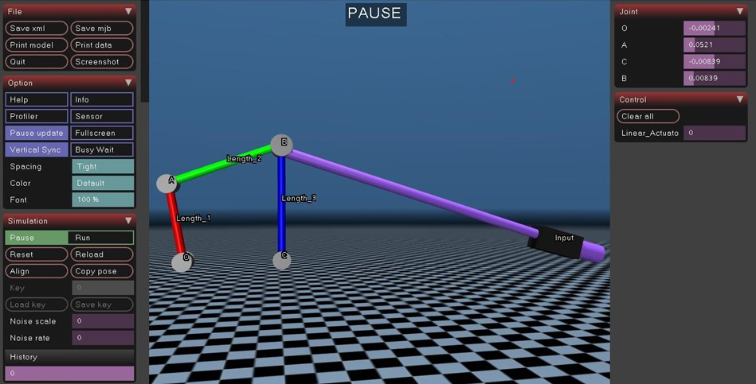
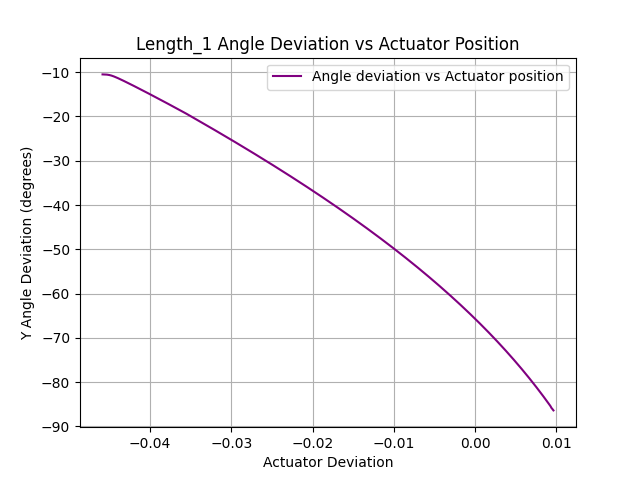

# Lab 4 — Optimus Knee Mechanism: Closed-Loop Kinematics with Linear Actuator in MuJoCo


> **Course:** Simulation of Robotic Systems — Faculty of Control Systems and Robotics, ITMO University <br>
> **Author:** Umer Ahmed Baig Mughal — MSc Robotics and Artificial Intelligence <br>
> **Topic:** Closed-Loop Kinematics · Optimus Knee Mechanism · Equality Constraints · Slide-Crank Actuator · Ramp Controller · Crank Rotation Tracking · Euler Angle Extraction

---

## Table of Contents

1. [Objective](#objective)
2. [Theoretical Background](#theoretical-background)
   - [Physical System Description](#physical-system-description)
   - [From Serial Chain to Closed-Loop — Key Changes](#from-serial-chain-to-closed-loop--key-changes)
   - [Closed-Loop Kinematic Constraint](#closed-loop-kinematic-constraint)
   - [Slide-Crank Linear Actuator](#slide-crank-linear-actuator)
   - [Ramp Controller Formulation](#ramp-controller-formulation)
   - [Crank Rotation Tracking](#crank-rotation-tracking)
   - [System Properties](#system-properties)
3. [MuJoCo Model Architecture](#mujoco-model-architecture)
   - [Closed-Loop Mechanisms in MuJoCo XML](#closed-loop-mechanisms-in-mujoco-xml)
   - [Body Hierarchy and Kinematic Structure](#body-hierarchy-and-kinematic-structure)
   - [XML Key Commands Reference](#xml-key-commands-reference)
4. [System Parameters](#system-parameters)
5. [Implementation](#implementation)
   - [File Structure](#file-structure)
   - [Function Reference](#function-reference)
   - [Algorithm Walkthrough](#algorithm-walkthrough)
6. [How to Run](#how-to-run)
7. [Results](#results)
8. [Simulation Analysis](#simulation-analysis)
9. [Dependencies](#dependencies)
10. [Notes and Limitations](#notes-and-limitations)
11. [Author](#author)
12. [License](#license)

---

## Objective

This lab moves beyond open serial-chain mechanisms to model a **closed-loop kinematic mechanism** — the Optimus Knee Mechanism (Variant 2) — in MuJoCo. The mechanism is set in motion by a **linear slide-crank actuator** that translates linear displacement into rotational movement at the crank joint. The rotation of the crank link (OA, `Length_1`) is tracked as a function of the actuator's linear displacement and visualized as a phase-space curve, rather than a time-series plot.

The key learning outcomes are:

- Understanding the fundamental difference between open serial-chain kinematics (Labs 2 and 3) and **closed-loop kinematics**, where two independent body trees are connected by an equality constraint to form a single rigid mechanism.
- Building a closed-loop mechanism in MuJoCo XML using two separate body hierarchies rooted in the `<worldbody>`, connected by a `<connect>` equality constraint between two named sites (`s1` and `s2`) at the link endpoints.
- Configuring a **slide-crank motor actuator** using the `slidersite`, `cranksite`, and `cranklength` attributes — a completely different actuator type from the position actuator used in Lab 3 — to drive the mechanism with a linear motor.
- Implementing a **ramp controller** in Python that gradually increments the actuator control input from its minimum to maximum value over the simulation duration, driving the crank smoothly through its range of motion.
- Tracking the **rotation of the crank OA link (`Length_1`)** by extracting the `geom_xmat` rotation matrix, converting it to Euler angles via `scipy.spatial.transform.Rotation`, and computing the deviation from the initial angle.
- Generating and interpreting a **single phase-space plot** of crank rotation angle deviation (Y-axis) versus actuator linear displacement deviation (X-axis), revealing the kinematic relationship between linear input and rotational output.

The lab is implemented in a single Python script operating on one MuJoCo XML model file, producing one output plot that characterizes the kinematic transmission of the closed-loop knee mechanism.

---

## Theoretical Background

### Physical System Description

The **Optimus Knee Mechanism** is a planar closed-loop kinematic chain designed to replicate the bending and extension motion of a knee joint. Unlike the open serial-chain RR mechanisms in Labs 2 and 3, this system forms a **closed loop** — two separate rigid body trees share endpoints that are constrained to coincide, forming a single four-bar-like kinematic structure.

The mechanism consists of three named links connected by four revolute joints:

- **Link OA (`Length_1`, red):** The crank arm, length $L_1 = 0.059$ m. Pivots at the fixed ground joint **O**. Its rotation angle is the primary tracked output.
- **Link AB (`Length_2`, green):** The coupler arm, length $L_2 = 0.0767$ m. Connects the tip of OA (joint **A**) to the floating constraint point that closes the loop at site `s1`.
- **Link CB (`Length_3`, blue):** The rocker arm, length $L_3 = 0.0885$ m. Pivots at the second fixed ground joint **C**, with its tip constrained to coincide with the tip of AB at site `s2`.

The closed loop is driven by a **linear slide-crank actuator** attached to a separate input body. The motor converts linear displacement (extending along the connecting rod of length $L_5 = 0.295$ m) into rotational motion transmitted through the constraint network to joint O. As the actuator extends, the crank rotates and the entire mechanism moves as a coherent closed-loop system.

### From Serial Chain to Closed-Loop — Key Changes

Compared to Lab 3, every structural aspect of the model is fundamentally different:

| Aspect | Lab 3 (Serial RR) | Lab 4 (Closed-Loop Knee) |
|--------|------------------|--------------------------|
| Mechanism topology | Open serial chain | Closed loop (two body trees + equality) |
| Number of body trees | 1 | 3 (Chain OA, Chain CB, Input body) |
| Kinematic closure | None | `<connect site1="s1" site2="s2">` |
| Joints | A, B (revolute, y-axis) | O, A, C, B (revolute, y-axis) |
| Tendons | 2 elastic spatial tendons | None |
| Actuator type | `<position>` on joint B | `<motor>` slide-crank on LA\_site → s2 |
| Controller | PD (error + velocity feedback) | Ramp (fixed increment to max) |
| Output plot | 4 time-series plots | 1 phase-space plot (angle vs displacement) |
| Tracked quantity | Joint qpos, EE position, pitch | Crank OA angle deviation vs actuator deviation |
| Simulation timestep | 0.002 s (set in script) | 0.001 s (set in XML) |

### Closed-Loop Kinematic Constraint

The key to modelling a closed-loop mechanism in MuJoCo is the `<equality>` block. Because MuJoCo builds simulation state from a tree-structured body hierarchy, a closed loop cannot be expressed purely through the body parent-child relationships. Instead, two body trees are built separately, and their endpoints are linked by a **site-to-site connect constraint**:

```xml
<equality>
    <connect site1="s1" site2="s2" />
</equality>
```

This constraint forces the world-frame positions of `s1` (tip of link AB, on joint A's body) and `s2` (tip of link CB, on joint C's body) to remain identical at all times. MuJoCo enforces this as a holonomic constraint in its constrained dynamics solver, effectively closing the kinematic loop without explicitly defining a circular body graph.

**Site placement for constraint closure:**

| Site | Parent Body | Local Position | Purpose |
|------|------------|----------------|---------|
| `s1` | Joint A body | `(0.0767, 0, 0.04)` | Tip of coupler AB — one end of equality |
| `s2` | Joint C body | `(0, 0, 0.085)` | Tip of rocker CB — other end of equality |

When the mechanism moves, the constraint solver continuously applies corrective forces to maintain `pos(s1) = pos(s2)`, transmitting motion across the loop.

### Slide-Crank Linear Actuator

The actuator used in Lab 4 is a **slide-crank motor** — a completely different type from the position actuator used in Lab 3. In MuJoCo, a slide-crank motor is defined using the `<motor>` element with three special geometric attributes:

```xml
<actuator>
    <motor name="Linear_Actuator" slidersite="LA_site" cranksite="s2"
           cranklength="0.295" ctrlrange="0 0.5" gear="1" />
</actuator>
```

| Attribute | Value | Meaning |
|-----------|-------|---------|
| `slidersite` | `"LA_site"` | The sliding end of the actuator — attached to the Input body |
| `cranksite` | `"s2"` | The crank end — connected to the top of rocker link CB |
| `cranklength` | `0.295` m | Length of the connecting rod $L_5$ between the slider and crank |
| `ctrlrange` | `"0 0.5"` | Control signal range — actuator extends from 0 to 0.5 units |
| `gear` | `1` | No force scaling |

The actuator works by changing the distance between `LA_site` and `s2` by controlling a virtual connecting rod of length $L_5 = 0.295$ m. As the control signal increases, the linear displacement drives `s2` (top of the rocker CB), which through the equality constraint and joint kinematics, propagates rotation to joint O and the crank OA link.

The `Input` body is positioned at `pos="0.25 0 0.5"` with `euler="0 -75 0"`, pre-angling it to set the initial geometry of the slide-crank mechanism correctly for the given link parameters.

### Ramp Controller Formulation

Unlike the PD feedback controller of Lab 3, the controller here is a **simple open-loop ramp**: the actuator control signal is incremented by a fixed step at every simulation step until it reaches the actuator's maximum control value, then held there:

```
If current_ctrl < actuator_ctrlrange_max:
    current_ctrl += CTRL_INCREMENT
Else:
    current_ctrl = actuator_ctrlrange_max

data.ctrl[0] = current_ctrl
```

| Parameter | Variable | Value | Description |
|-----------|----------|-------|-------------|
| Increment per step | `CTRL_INCREMENT` | 0.0005 | Added to ctrl each simulation step |
| Maximum control | `actuator_ctrlrange[0][1]` | 0.5 | Read from XML actuator definition |
| Starting control | `actuator_ctrlrange[0][0]` | 0.0 | Read from XML at loop start |
| Steps to reach max | — | 1000 steps | 0.5 / 0.0005 = 1000 steps ≈ 1 second at 0.001 s/step |

The actuator therefore reaches its maximum extension within approximately the first second of simulation, after which the crank has completed its range of rotation. The remaining ~9 seconds of the 10-second simulation hold the actuator at maximum displacement.

### Crank Rotation Tracking

The rotation of the crank OA link (`Length_1`) is tracked by extracting its geometry rotation matrix from `data.geom_xmat` and converting it to Euler angles using `scipy.spatial.transform.Rotation`:

```
1. geom_id       = mj_name2id(model, mjOBJ_GEOM, 'Length_1')
2. rotation_mat  = np.reshape(data.geom_xmat[geom_id], (3, 3))
3. rotation      = R.from_matrix(rotation_mat)
4. euler_angles  = rotation.as_euler('xyz', degrees=True)
5. angle_y       = euler_angles[1]    → rotation about y-axis (degrees)
```

The **y-axis rotation** is the relevant quantity because all joints rotate about the y-axis (`axis="0 1 0"`). The initial angle is recorded before the simulation loop begins, and the deviation from this initial value is recorded at every step:

```python
current_angle_y = euler_angles[1] - initial_angle_y
```

This deviation, plotted against the simultaneous actuator length deviation, produces the kinematic transmission curve.

### System Properties

| Property | Value | Notes |
|----------|-------|-------|
| Mechanism type | Closed-loop | Two body trees + equality constraint |
| Number of revolute joints | 4 | O (crank), A (coupler), C (rocker), B (floating) |
| Joint rotation axis | y-axis (`0 1 0`) | All four joints |
| Joint O angular range | ±75° | `range="-75 75"` |
| Joint A angular range | −35° to +180° | `range="-35 180"` |
| Joint B angular range | −35° to +180° | `range="-35 180"` |
| Joint C angular range | Unlimited | No range attribute |
| Joint O damping | 0.1 N·m·s/rad | Only joint with explicit damping |
| Equality constraint | `connect s1 ↔ s2` | Closes the kinematic loop |
| Actuator type | Slide-crank motor | `slidersite`, `cranksite`, `cranklength` |
| Actuator name | `"Linear_Actuator"` | Indexed via `data.ctrl[0]` |
| Actuator control range | 0 to 0.5 | `ctrlrange="0 0.5"` |
| Connecting rod length | $L_5 = 0.295$ m | `cranklength="0.295"` |
| Ramp increment | 0.0005 per step | `CTRL_INCREMENT` |
| Tendons | None | No `<tendon>` block |
| Simulation duration | 10 s | Wall-clock loop condition |
| Simulation timestep | 0.001 s | Defined in XML `<option timestep="0.001">` |
| Effective sampling rate | 1000 steps/s | $1 / 0.001$ |
| Output plot | 1 phase-space plot | Angle deviation vs actuator deviation |
| Angle deviation range | −10° to −90° | Negative — crank rotates downward |

---

## MuJoCo Model Architecture

### Closed-Loop Mechanisms in MuJoCo XML

Closed-loop mechanisms cannot be expressed by a single body tree because MuJoCo's body hierarchy is strictly a parent-child tree structure. To model a closed loop, the following approach is used:

**Step 1 — Build two separate open chains** rooted independently in the `<worldbody>`, one for each side of the loop (chain OA and chain CB).

**Step 2 — Place named sites** at the endpoints of the two chains that must meet to close the loop.

**Step 3 — Apply an equality constraint** using `<connect site1="..." site2="...">` to enforce that the two sites remain co-located at all times.

This approach is the standard MuJoCo pattern for closed-loop kinematic structures such as four-bar linkages, knee mechanisms, and parallel mechanisms. The constraint solver handles the loop closure forces internally.

The three actuation approaches from Lab 3 (torque, velocity, tendon-motor) are supplemented here by the **slide-crank motor**, which is purpose-built for mechanisms where a linear displacement drives a rotating crank:

```xml
<actuator>
    <motor name="Linear_Actuator" slidersite="LA_site" cranksite="s2"
           cranklength="0.295" ctrlrange="0 0.5" gear="1" />
</actuator>
```

This actuator type is uniquely suited to biomechanical knee models, where a tendon or hydraulic cylinder acts as the linear input to produce joint rotation.

### Body Hierarchy and Kinematic Structure

The model contains three independent body trees in the `<worldbody>`, closed by one equality constraint:

```
<worldbody>
 │
 ├── Chain 1 — Crank OA side (fixed pivot at O):
 │    └── body (pos="0 0 0.5", euler="0 -10.5 0")      ← ground-fixed, pre-angled
 │         ├── joint "O" (y-axis, ±75°, damping=0.1)    ← crank pivot — tracked joint
 │         ├── geom "O" (grey cylinder)                  ← pivot visual
 │         ├── geom "Length_1" (red cylinder, L1=0.059m) ← CRANK OA — rotation tracked
 │         └── body (pos="0 0 0.059", euler="0 17 0")    ← tip of OA, pre-angled
 │              ├── joint "A" (y-axis, −35° to +180°)
 │              ├── geom "A" (grey cylinder)
 │              ├── geom "Length_2" (green cylinder, L2=0.0767m, euler="0 60 0") ← COUPLER AB
 │              └── site "s1" (pos="0.0767 0 0.04")      ← CONSTRAINT ANCHOR — tip of AB
 │
 ├── Chain 2 — Rocker CB side (fixed pivot at C):
 │    └── body (pos="0.072 0 0.5")                       ← ground-fixed second pivot
 │         ├── joint "C" (y-axis, unlimited)              ← rocker pivot
 │         ├── geom "C" (grey cylinder)
 │         ├── geom "Length_3" (blue cylinder, L3=0.0885m, fromto) ← ROCKER CB
 │         ├── site "s2" (pos="0 0 0.085")                ← CONSTRAINT ANCHOR — tip of CB
 │         └── body (pos="0 0 0.0885")
 │              └── joint "B" (y-axis, −35° to +180°)    ← floating joint at loop closure
 │
 └── Input body — Linear actuator housing:
      └── body name="Input" (pos="0.25 0 0.5", euler="0 -75 0")
           ├── geom "Input" (dark box)                    ← actuator housing visual
           └── site "LA_site" (pos="0.025 0 -0.055")      ← SLIDER END of actuator

<equality>
    <connect site1="s1" site2="s2" />   ← CLOSES THE LOOP: tip of AB = tip of CB

<actuator>
    <motor name="Linear_Actuator"
           slidersite="LA_site"          ← slider on Input body
           cranksite="s2"                ← crank at top of rocker CB
           cranklength="0.295"           ← connecting rod length L5
           ctrlrange="0 0.5" gear="1" />
```

**Geometry colour coding:**

| Geom | Colour | Link | Length |
|------|--------|------|--------|
| `Length_1` | Red | Crank OA | L1 = 0.059 m |
| `Length_2` | Green | Coupler AB | L2 = 0.0767 m |
| `Length_3` | Blue | Rocker CB | L3 = 0.0885 m |
| `O`, `A`, `C`, `B` | Grey | Joint pivots | radius = 0.007 m |
| `Input` | Dark grey | Actuator housing | box |

### MuJoCo Model Visualization



### XML Key Commands Reference

| XML Element / Attribute | Purpose |
|------------------------|---------|
| `<option timestep="0.001">` | Sets the simulation timestep to 1 ms — defined in XML, not overridden in script |
| `<statistic center="0.15 0 0.5" extent="0.5">` | Sets viewer camera framing to centre the mechanism |
| `<joint name="O" range="-75 75" damping="0.1">` | Crank pivot with ±75° limits and explicit viscous damping |
| `<joint name="A" range="-35 180">` | Coupler joint with asymmetric range |
| `<joint name="C">` | Rocker pivot — no range limit, free rotation |
| `<joint name="B" range="-35 180">` | Floating joint at loop closure point |
| `contype="0"` | Disables collision detection for all mechanism geoms (cosmetic links only) |
| `<site name="s1" pos="...">` | Named constraint anchor at tip of coupler AB |
| `<site name="s2" pos="...">` | Named constraint anchor at tip of rocker CB |
| `<site name="LA_site" pos="...">` | Slider attachment site for the linear actuator |
| `<connect site1="s1" site2="s2">` | Equality constraint that closes the kinematic loop by co-locating the two site positions |
| `<motor slidersite="LA_site" cranksite="s2" cranklength="0.295">` | Slide-crank motor: linear displacement between LA\_site and s2 via a connecting rod of length L5 |
| `ctrlrange="0 0.5"` | Actuator extends from 0 to 0.5 — sets both the starting and maximum control values |
| `data.actuator_length[0]` | Python API: current physical length of the actuator (not `qpos`) |
| `model.actuator_ctrlrange[0][0/1]` | Python API: reads min/max control range from model at runtime |

---

## System Parameters

### Geometric Parameters (Given Task Values — Variant 2)

| Parameter | Symbol | Value | Unit | Description |
|-----------|--------|-------|------|-------------|
| Crank length | $L_1$ | 0.059 | m | Length of crank arm OA (`Length_1`) |
| Coupler length | $L_2$ | 0.0767 | m | Length of coupler AB (`Length_2`) |
| Rocker length | $L_3$ | 0.0885 | m | Length of rocker CB (`Length_3`) |
| Fixed pivot spacing | $L_4$ | 0.059 | m | Distance between ground pivots O and C |
| Connecting rod length | $L_5$ | 0.295 | m | Slide-crank rod length (`cranklength="0.295"`) |

### Actuator and Controller Parameters

| Parameter | Variable | Value | Unit | Description |
|-----------|----------|-------|------|-------------|
| Maximum control (defined) | `MAX_CTRL` | 0.01 | — | Defined as constant — **not used** in controller (see Notes) |
| Control increment | `CTRL_INCREMENT` | 0.0005 | per step | Step size added to ctrl each simulation step |
| Simulation duration | `SIMULATION_TIME` | 10 | s | Wall-clock loop limit |
| Starting control value | `actuator_ctrlrange[0][0]` | 0.0 | — | Read from XML at loop initialization |
| Maximum control (used) | `actuator_ctrlrange[0][1]` | 0.5 | — | Read from XML — actual ramp ceiling |
| Actuator gear ratio | — | 1 | — | `gear="1"` in XML |

### Simulation Parameters

| Parameter | Value | Unit | Description |
|-----------|-------|------|-------------|
| Simulation timestep | 0.001 | s | Defined in XML `<option timestep="0.001">` |
| Effective sampling rate | 1000 | steps/s | $1 / 0.001$ |
| Total data points | ~10000 | steps | At 1000 steps/s over 10 s |
| Steps to reach max ctrl | ~1000 | steps | 0.5 / 0.0005 = 1000 steps ≈ 1 s |
| Tracked geom | `Length_1` | — | `mjOBJ_GEOM` queried by name |
| Tracked quantity | Y-axis Euler angle deviation | degrees | `euler_angles[1] − initial_angle_y` |
| Actuator length reference | `data.actuator_length[0]` | m | Physical slider extension |

---

## Implementation

### File Structure

```
Lab_4/
├── README.md
├── src/                                          # Python simulation script
│   └── Optimus_Knee_Mechanism.py                     # Ramp controller, data collection, phase-space plot
├── model/                                        # MuJoCo XML model
│   └── MuJoCo_Optimus_Knee_Model.xml                 # Closed-loop Optimus Knee Mechanism with actuator
├── results/                                      # Generated plots / outputs
│   ├── MuJoCo_Model_Visualization.jpg                # MuJoCo viewer screenshot of the mechanism
│   └── Angle_vs_Actuator_Position.png                # Phase-space: crank angle vs actuator displacement
└── report/                                       # Lab documentation
    └── Lab4_Report.pdf
```

**Script and model grouping by purpose:**

| File | Type | Purpose |
|------|------|---------|
| `MuJoCo_Optimus_Knee_Model.xml` | MuJoCo XML | Closed-loop knee mechanism: body trees, joints, equality constraint, slide-crank actuator |
| `Optimus_Knee_Mechanism.py` | Python | Ramp controller, angle and actuator tracking, phase-space plot |

### Function Reference

#### Model Loading — inside `simulate()`

Loads the MuJoCo model and initialises simulation state objects inside the `simulate()` function.

```python
model = mujoco.MjModel.from_xml_path(MODEL_NAME)
data = mujoco.MjData(model)
```

| Object | Type | Description |
|--------|------|-------------|
| `model` | `MjModel` | Static model: geometry, joints, equality constraints, actuator definition |
| `data` | `MjData` | Dynamic state: `qpos`, `ctrl`, `geom_xmat`, `actuator_length` |

---

#### `get_euler_angles_from_rotation_matrix(rotation_matrix)` — utility conversion

Converts a $3 \times 3$ rotation matrix to Euler angles (xyz convention, degrees) using `scipy.spatial.transform.Rotation`. This is a standalone utility function — **defined but never directly called** in the simulation loop; its logic is duplicated inside `get_l1_rotation`.

```python
def get_euler_angles_from_rotation_matrix(rotation_matrix):
    rotations = R.from_matrix(rotation_matrix)
    euler = rotations.as_euler('xyz', degrees=True)
    return euler
```

| Argument | Type | Description |
|----------|------|-------------|
| `rotation_matrix` | `np.ndarray (3×3)` | Rotation matrix extracted from `geom_xmat` |

**Returns:** `np.ndarray([roll, pitch, yaw])` — Euler angles in degrees, xyz convention.

---

#### `get_l1_rotation(model, data, geom_name)` — crank rotation extraction

Retrieves the rotation matrix of a named geometry from `data.geom_xmat`, reshapes it from a flat 9-element array to a $3 \times 3$ matrix, and returns the Euler angles in degrees. Used to track the y-axis rotation of `Length_1` (crank OA) throughout the simulation.

```python
def get_l1_rotation(model, data, geom_name):
    geom_id = mujoco.mj_name2id(model, mujoco.mjtObj.mjOBJ_GEOM, geom_name)
    rotation_matrix = np.reshape(data.geom_xmat[geom_id], (3, 3))
    rotation = R.from_matrix(rotation_matrix)
    euler_angles = rotation.as_euler('xyz', degrees=True)
    return euler_angles
```

| Argument | Type | Description |
|----------|------|-------------|
| `model` | `MjModel` | MuJoCo model object |
| `data` | `MjData` | Current simulation state |
| `geom_name` | `str` | Name of the geometry to track (`'Length_1'`) |

**Returns:** `np.ndarray([roll, pitch, yaw])` — Euler angles in degrees. Only `euler_angles[1]` (y-axis rotation) is used in the simulation loop.

---

#### `controller(model, data, current_ctrl)` — ramp actuator control

Increments the actuator control signal by `CTRL_INCREMENT` each call until it reaches the maximum value read from `model.actuator_ctrlrange`, then holds it there. Writes the updated value directly to `data.ctrl[0]`.

```python
def controller(model, data, current_ctrl):
    if current_ctrl < model.actuator_ctrlrange[0][1]:
        current_ctrl += CTRL_INCREMENT
    else:
        current_ctrl = model.actuator_ctrlrange[0][1]
    data.ctrl[0] = current_ctrl
    return current_ctrl
```

| Argument | Type | Description |
|----------|------|-------------|
| `model` | `MjModel` | MuJoCo model object — provides `actuator_ctrlrange` |
| `data` | `MjData` | Current simulation state — `ctrl[0]` is written |
| `current_ctrl` | `float` | Current control value passed in and returned updated |

**Control law:** `current_ctrl += 0.0005` per step, clamped at `model.actuator_ctrlrange[0][1]` (= 0.5 from XML).

**Note:** The constant `MAX_CTRL = 0.01` defined at the top of the script is not used here — the actual ceiling is read directly from the model at runtime.

---

#### Initial State Recording — before simulation loop

Before the loop starts, the initial actuator length and initial crank y-angle are recorded as baseline references for computing deviations throughout the simulation.

```python
initial_actuator_position = data.actuator_length[0]
initial_euler_angles = get_l1_rotation(model, data, 'Length_1')
initial_angle_y = initial_euler_angles[1]
```

| Variable | Source | Description |
|----------|--------|-------------|
| `initial_actuator_position` | `data.actuator_length[0]` | Physical length of actuator before motion starts |
| `initial_angle_y` | `get_l1_rotation(...)[1]` | Y-axis Euler angle of `Length_1` at rest position |

Both values are subtracted from current readings at each step to obtain deviation-from-initial measurements for the phase-space plot.

---

#### Plot Generation — `matplotlib.pyplot`

A single phase-space figure is generated after the simulation loop exits:

| Plot | X-axis Data | Y-axis Data | Colour | Title |
|------|------------|------------|--------|-------|
| Crank angle vs actuator | `actuator_positions` (actuator length deviation, m) | `angle_deviations` (y-angle deviation, degrees) | Purple | Length\_1 Angle Deviation vs Actuator Position |

Unlike all previous labs, the x-axis is **not time or step index** — it is the actuator's physical displacement deviation from its initial length, making this a kinematic relationship curve rather than a time-series.

---

### Algorithm Walkthrough

**Simulation and data collection loop (`Optimus_Knee_Mechanism.py`):**

```
1. Define constants:
       MODEL_NAME       = path to MuJoCo_Optimus_Knee_Model.xml
       MAX_CTRL         = 0.01    (defined — NOT used in controller)
       CTRL_INCREMENT   = 0.0005
       SIMULATION_TIME  = 10 s

2. Load XML model inside simulate():
       model = MjModel.from_xml_path(MODEL_NAME)
       data  = MjData(model)

3. Record initial states:
       initial_actuator_position ← data.actuator_length[0]
       initial_angle_y           ← get_l1_rotation(model, data, 'Length_1')[1]
       (printed to console as debug output)

4. Initialise data collectors:
       actuator_positions = []    ← actuator length deviation from initial
       angle_deviations   = []    ← y-angle deviation of Length_1 from initial

5. Launch passive viewer:
       with mujoco.viewer.launch_passive(model, data) as viewer:
           current_ctrl = model.actuator_ctrlrange[0][0]   (= 0.0)

6. Simulation loop (runs while viewer is open AND elapsed time < 10 s):

       a. Compute current y-angle deviation of crank OA:
              euler_angles    = get_l1_rotation(model, data, 'Length_1')
              current_angle_y = euler_angles[1] − initial_angle_y
              angle_deviations.append(current_angle_y)

       b. Compute actuator length deviation:
              current_actuator_position = data.actuator_length[0]
              actuator_deviation = current_actuator_position − initial_actuator_position
              actuator_positions.append(actuator_deviation)

       c. Apply ramp controller:
              current_ctrl = controller(model, data, current_ctrl)
              → increments data.ctrl[0] by 0.0005 until reaching 0.5

       d. Step simulation:
              mujoco.mj_step(model, data)

       e. Sync viewer:
              viewer.sync()

       f. Sleep to match XML timestep (real-time pacing):
              next_step = model.opt.timestep − (time.time() − step_start)
              if next_step > 0: time.sleep(next_step)

7. After loop exits, generate phase-space plot:
       plt.plot(actuator_positions, angle_deviations, color="purple")
       x-axis: Actuator Deviation (m)
       y-axis: Y Angle Deviation (degrees)

8. plt.show() — display the figure
```

### Crank Angle vs Actuator Position



---

## How to Run

### Clone the Repository

```bash
git clone https://github.com/umerahmedbaig7/Simulation-of-Robotic-Systems.git
cd Simulation-of-Robotic-Systems/Lab_4
```

### Prerequisites

```bash
pip install mujoco matplotlib numpy scipy
```

> MuJoCo 2.3+ with Python bindings is required. The passive viewer requires a display environment (not headless).

### Update the XML Path

Open `src/Optimus_Knee_Mechanism.py` and update `MODEL_NAME` to point to your local copy of `MuJoCo_Optimus_Knee_Model.xml`:

```python
MODEL_NAME = 'path/to/MuJoCo_Optimus_Knee_Model.xml'
```

### Running the Simulation

```bash
python src/Optimus_Knee_Mechanism.py
```

This will:

1. Open the MuJoCo passive viewer showing the Optimus Knee Mechanism.
2. Print the initial actuator position and crank angle to the console.
3. Run the simulation for **10 seconds** in real-time with the ramp controller driving the linear actuator.
4. After the viewer closes, generate and display **1 phase-space plot**: crank angle deviation vs actuator displacement deviation.

### Changing Simulation Duration

Open `Optimus_Knee_Mechanism.py` and modify the `SIMULATION_TIME` constant:

```python
SIMULATION_TIME = 10   # change to desired seconds
```

### Modifying the Ramp Speed

To change how quickly the actuator extends, modify `CTRL_INCREMENT`:

```python
CTRL_INCREMENT = 0.0005   # smaller = slower ramp, larger = faster ramp
```

### Modifying the Actuator Range

To change the actuator's maximum extension, edit the `ctrlrange` in `MuJoCo_Optimus_Knee_Model.xml`:

```xml
<motor name="Linear_Actuator" ... ctrlrange="0 0.5" ... />
```

---

## Results

### Phase-Space Plot

| Plot | X-axis | Y-axis | Range | Behaviour |
|------|--------|--------|-------|-----------|
| Crank Angle vs Actuator Position | Actuator deviation (m) | Y angle deviation (degrees) | −10° to −90° | Monotonically decreasing — smooth kinematic transmission curve |

### Qualitative Observations

**Actuator displacement:**
- The actuator begins at its initial rest length (deviation = 0) and extends linearly as the ramp controller increments the control signal each step. It reaches its maximum extension (corresponding to `ctrlrange` maximum of 0.5) within approximately the first second of simulation.

**Crank rotation:**
- As the actuator extends, joint O rotates and `Length_1` (crank OA) sweeps downward — the y-angle deviation becomes progressively more negative, ranging from approximately −10° at the start to −90° at full actuator extension. The curve is smooth and monotonically decreasing, reflecting the deterministic kinematic relationship of the closed-loop mechanism. Once the actuator reaches maximum extension, the angle deviation holds at approximately −90° for the remainder of the simulation.

**Kinematic transmission:**
- The curve is not linear — its slope (sensitivity) varies along the actuator's range. A steeper section indicates that a small change in actuator displacement produces a large change in crank angle (high kinematic amplification). A flatter section indicates lower sensitivity. This non-linearity is characteristic of crank-rocker mechanisms, where the mechanical advantage varies continuously as a function of the configuration.

---

## Simulation Analysis

### Kinematic Transmission Curve

The single phase-space plot reveals the complete kinematic relationship between linear actuator input and rotational crank output for the Optimus Knee Mechanism. Because the ramp controller drives the actuator monotonically from rest to full extension, the plot traces the entire input-output map of the mechanism in one simulation run.

The curve from −10° to −90° shows that the mechanism achieves approximately 80° of crank rotation over its full actuator stroke — a significant angular amplification for a compact mechanism with link lengths on the order of 50–90 mm.

### Effect of Equality Constraint on Dynamics

The `<connect>` equality constraint introduces constraint forces at every step to maintain `pos(s1) = pos(s2)`. These forces are computed by MuJoCo's constrained dynamics solver and transmitted through the body hierarchy. Without this constraint, the two body trees would move independently. The smooth curve in the output confirms that the constraint is well-conditioned and the solver successfully maintains loop closure throughout the actuator's full range.

### Ramp Controller vs PD Controller

| Aspect | Lab 3 (PD) | Lab 4 (Ramp) |
|--------|-----------|--------------|
| Type | Closed-loop feedback | Open-loop ramp |
| Input | Position error + velocity | Constant increment per step |
| Tracks trajectory | Yes (sinusoidal) | No — drives to max |
| Overshoot | Possible | None — monotonic |
| Use case | Trajectory following | Range-of-motion mapping |

The ramp controller is well-suited here because the goal is to map the mechanism's kinematic behaviour across its full range — not to track a specific trajectory. Driving the actuator monotonically ensures the phase-space plot traces the kinematic curve cleanly without oscillation or backtracking.

### Joint O Damping

Joint O is the only joint with explicit damping (`damping="0.1"`). This provides viscous resistance at the crank pivot that prevents the mechanism from accelerating uncontrollably as the actuator ramps up. Without it, inertial effects and constraint forces could cause the mechanism to overshoot or oscillate, distorting the phase-space curve. The damping ensures the crank responds smoothly to the actuator ramp.

---

## Dependencies

| Package | Version | Purpose |
|---------|---------|---------|
| `Python` | ≥ 3.8 | Runtime environment |
| `mujoco` | ≥ 2.3 | Physics engine, XML model loading, `mj_step`, equality constraint solver, `geom_xmat`, `actuator_length`, `ctrl` |
| `mujoco.viewer` | (bundled) | Real-time passive viewer for simulation visualization |
| `NumPy` | ≥ 1.21 | `np.reshape()` for rotation matrix extraction from flat `geom_xmat` array |
| `SciPy` | ≥ 1.7 | `scipy.spatial.transform.Rotation` — rotation matrix to Euler angle conversion |
| `Matplotlib` | ≥ 3.4 | Phase-space plot: crank angle deviation vs actuator position deviation |

Install all dependencies via pip:

```bash
pip install mujoco matplotlib numpy scipy
```

---

## Notes and Limitations

- **XML file path is hardcoded:** The script uses an absolute Windows path (`d:\ITMO University\...`). Before running, update `MODEL_NAME` in `Optimus_Knee_Mechanism.py` to your local path, or place `MuJoCo_Optimus_Knee_Model.xml` in the working directory and use a relative path.
- **Timestep is defined in XML, not in the script:** Unlike Labs 2 and 3 where `m.opt.timestep` was set explicitly in Python, Lab 4 uses the timestep defined in the XML (`<option timestep="0.001">`). The script reads `model.opt.timestep` for the sleep calculation but never modifies it.
- **Plot is phase-space, not time-series:** The x-axis of the output plot is actuator length deviation (metres), not time or step index. This makes it a kinematic transmission map rather than a temporal trace. The two quantities are coupled by the ramp controller driving the actuator monotonically, so the plot cleanly traces the mechanism's kinematic curve.
- **`data.actuator_length[0]` vs `data.qpos`:** The actuator displacement is tracked using `data.actuator_length[0]` — the physical length of the slide-crank actuator — not from `qpos`. This is the correct API for slide-crank motors, since their displacement is not a generalized coordinate in the body tree.
- **Mechanism reaches max rotation within ~1 second:** Given `CTRL_INCREMENT = 0.0005` per step and a timestep of 0.001 s, the actuator reaches `ctrlrange` maximum (0.5) after approximately 1000 steps = 1 second. The remaining ~9 seconds of simulation hold the mechanism at maximum displacement.
- **Joint C has no angular range limit:** Unlike joints O, A, and B which have defined `range` attributes, joint C is unconstrained in rotation. In practice, the equality constraint and mechanism geometry prevent unrealistic angles, but no hard stops are enforced at joint C.
- **`if __name__ == '__main__': simulate()`:** This script uses the proper Python module entry-point pattern — the simulation only runs when the script is executed directly, not when imported as a module. This is the first lab in the series to use this pattern.
- **Units:** All lengths in **metres**, angular values (Euler angles, deviations) in **degrees**, time in **seconds**.
- **Viewer must remain open:** Closing the viewer window before 10 seconds will stop data collection early, producing a truncated phase-space curve that may not reach the full −90° angle deviation.

---

## Author

**Umer Ahmed Baig Mughal** <br>
Master's in Robotics and Artificial Intelligence <br>
*Specialization: Machine Learning · Computer Vision · Human-Robot Interaction · Autonomous Systems · Robotic Motion Control*

---

## License

This project is intended for **academic and research use**. It was developed as part of the *Simulation of Robotic Systems* course within the MSc Robotics and Artificial Intelligence program at ITMO University. Redistribution, modification, and use in derivative academic work are permitted with appropriate attribution to the original author.

---

*Lab 4 — Simulation of Robotic Systems | MSc Robotics and Artificial Intelligence | ITMO University*

